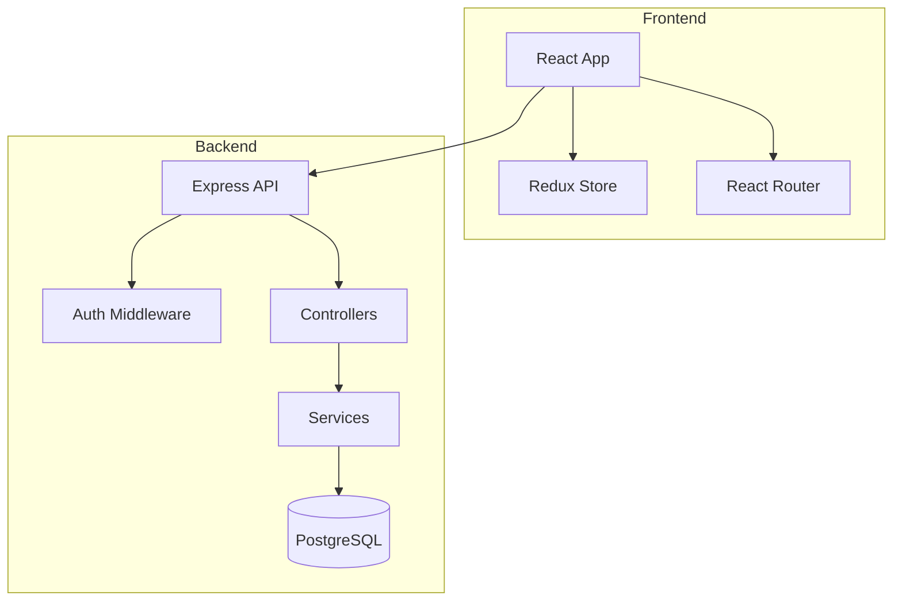

# /siftcoder:examples - Real Usage Examples

Browse real-world examples of siftcoder in action.

## Usage

```
/siftcoder:examples [category]
```

## Arguments
- `$ARGUMENTS` - Optional category: `build`, `maintain`, `document`, `ideate`, or `all`

## Instructions

Show practical, real-world examples that users can copy and adapt.

---

## Phase 1: Choose Example Category

If no category specified, show the menu:

**Use AskUserQuestion tool:**
```
Question: "What kind of example would you like to see?"
Header: "Examples"
Options:
- "Build & Ideate" - "From idea to working code"
- "Maintain & Debug" - "Investigate, fix, refactor safely"
- "Security & Compliance" - "Audits, licenses, GDPR"
- "Testing & Review" - "Test generation, PR reviews"
- "Docs & Learning" - "Documentation, onboarding"
```

---

## BUILD Examples

```
━━━━━━━━━━━━━━━━━━━━━━━━━━━━━━━━━━━━━━━━━━━━━━━━━━━━━━━━━━━
 EXAMPLE: Build a SaaS from an Idea
━━━━━━━━━━━━━━━━━━━━━━━━━━━━━━━━━━━━━━━━━━━━━━━━━━━━━━━━━━━

Step 1: Start with an idea
─────────────────────────────────────────────────────────────
YOU: /siftcoder:ideate "I want to build a habit tracking app
     with streaks, reminders, and social accountability"

SIFTCODER: [Asks about domain, depth, competitors]
           [Researches market: Habitica, Streaks, Loop]
           [Suggests 12 features with priorities]
           [Generates FEATURE_IDEAS.md]

Step 2: Review and build
─────────────────────────────────────────────────────────────
YOU: /siftcoder:build ./FEATURE_IDEAS.md

SIFTCODER: [Planner creates implementation plan]
           [Coder builds feature by feature]
           [QA validates each feature]
           [Auto-commits progress]

Step 3: Document
─────────────────────────────────────────────────────────────
YOU: /siftcoder:document architecture

SIFTCODER: [Generates Mermaid diagrams]
           [Creates code map]
           [Documents API endpoints]


━━━━━━━━━━━━━━━━━━━━━━━━━━━━━━━━━━━━━━━━━━━━━━━━━━━━━━━━━━━
 EXAMPLE: Build from Detailed Spec
━━━━━━━━━━━━━━━━━━━━━━━━━━━━━━━━━━━━━━━━━━━━━━━━━━━━━━━━━━━

Your spec file (./SPEC.md):
─────────────────────────────────────────────────────────────
# E-Commerce API

## Features
- User registration and login
- Product catalog with categories
- Shopping cart
- Stripe checkout
- Order history

## Tech Stack
- Node.js + Express
- PostgreSQL
- Redis for sessions
─────────────────────────────────────────────────────────────

YOU: /siftcoder:build ./SPEC.md

SIFTCODER: [Extracts 5 features with acceptance criteria]
           [Creates subtasks for each]
           [Builds autonomously with quality gates]
           [Runs tests after each feature]


━━━━━━━━━━━━━━━━━━━━━━━━━━━━━━━━━━━━━━━━━━━━━━━━━━━━━━━━━━━
 EXAMPLE: Add Feature to Existing App
━━━━━━━━━━━━━━━━━━━━━━━━━━━━━━━━━━━━━━━━━━━━━━━━━━━━━━━━━━━

Step 1: Learn the codebase first
─────────────────────────────────────────────────────────────
YOU: /siftcoder:understand

SIFTCODER: [Scans structure: React + Express]
           [Detects patterns: camelCase, feature-folders]
           [Finds gotchas: needs NODE_ENV]
           [Stores knowledge for consistency]

Step 2: Add the feature
─────────────────────────────────────────────────────────────
YOU: /siftcoder:add-feature "Add dark mode with system
     preference detection and manual toggle"

SIFTCODER: [Uses detected patterns]
           [Creates ThemeContext matching your style]
           [Adds toggle component like your other components]
           [Updates existing components to use theme]
           [Adds tests following your test patterns]
```

---

## MAINTAIN Examples

```
━━━━━━━━━━━━━━━━━━━━━━━━━━━━━━━━━━━━━━━━━━━━━━━━━━━━━━━━━━━
 EXAMPLE: Safe Bug Investigation
━━━━━━━━━━━━━━━━━━━━━━━━━━━━━━━━━━━━━━━━━━━━━━━━━━━━━━━━━━━

Scenario: Users report checkout fails for orders over $999

Step 1: Investigate safely (READ-ONLY)
─────────────────────────────────────────────────────────────
YOU: /siftcoder:investigate "Checkout fails for orders over $999"

SIFTCODER:
┌─────────────────────────────────────────────────────────┐
│ MODE: INVESTIGATE (read-only)                           │
│ Can read: Everything                                    │
│ Can modify: Nothing                                     │
└─────────────────────────────────────────────────────────┘

[Searches for checkout, payment, order code]
[Finds: src/services/payment.ts:142]
[Issue: parseInt() truncates cents for large amounts]

INVESTIGATION REPORT:

Root Cause:
├── File: src/services/payment.ts:142
├── Code: const amount = parseInt(total)
├── Problem: parseInt truncates decimals
└── Fix: Use Math.round(total * 100) for cents

Affected Files:
├── src/services/payment.ts    ← Fix here
└── src/tests/payment.test.ts  ← Add test

Step 2: Confirm scope and fix
─────────────────────────────────────────────────────────────
YOU: /siftcoder:fix "Payment truncation bug"

SIFTCODER:
┌─────────────────────────────────────────────────────────┐
│ MODIFIABLE:                                             │
│ ├── src/services/payment.ts                             │
│ └── src/tests/payment.test.ts                           │
│                                                         │
│ PROTECTED:          (cannot modify)                     │
│ └── ... everything else                                 │
└─────────────────────────────────────────────────────────┘

[Fixes payment.ts]
[Adds test case for $1000+]
[Runs blast radius check]

BLAST RADIUS: CONTAINED
├── checkout.test.ts ✓ 23/23 passing
├── orders.test.ts ✓ 31/31 passing
└── All protected areas unaffected


━━━━━━━━━━━━━━━━━━━━━━━━━━━━━━━━━━━━━━━━━━━━━━━━━━━━━━━━━━━
 EXAMPLE: Expanding Fix Scope
━━━━━━━━━━━━━━━━━━━━━━━━━━━━━━━━━━━━━━━━━━━━━━━━━━━━━━━━━━━

Sometimes you need to modify more files:

YOU: /siftcoder:scope show

SIFTCODER:
CURRENT SCOPE:
├── MODIFIABLE: src/services/payment.ts
└── PROTECTED: everything else

YOU: /siftcoder:scope add src/utils/currency.ts

SIFTCODER:
UPDATED SCOPE:
├── MODIFIABLE:
│   ├── src/services/payment.ts
│   └── src/utils/currency.ts
└── PROTECTED: everything else

YOU: /siftcoder:scope add src/services/checkout.ts

SIFTCODER:
⚠️  WARNING: checkout.ts is a critical file.
    Adding it increases blast radius.

    [Add anyway] [Keep protected] [Show dependencies]


━━━━━━━━━━━━━━━━━━━━━━━━━━━━━━━━━━━━━━━━━━━━━━━━━━━━━━━━━━━
 EXAMPLE: Rollback After Bad Fix
━━━━━━━━━━━━━━━━━━━━━━━━━━━━━━━━━━━━━━━━━━━━━━━━━━━━━━━━━━━

If something goes wrong:

YOU: /siftcoder:rollback

SIFTCODER:
AVAILABLE CHECKPOINTS:
├── [1] fix/payment-bug - 10 min ago - 2 files changed
├── [2] feature/dark-mode - 2 hours ago - 8 files changed
└── [3] pre-refactor - 1 day ago - clean state

Select checkpoint: [1]

ROLLED BACK:
├── Reverted: src/services/payment.ts
├── Reverted: src/tests/payment.test.ts
└── State restored to pre-fix

Your code is back to the previous state.
```

---

## DOCUMENT Examples

```
━━━━━━━━━━━━━━━━━━━━━━━━━━━━━━━━━━━━━━━━━━━━━━━━━━━━━━━━━━━
 EXAMPLE: Generate Architecture Diagrams
━━━━━━━━━━━━━━━━━━━━━━━━━━━━━━━━━━━━━━━━━━━━━━━━━━━━━━━━━━━

YOU: /siftcoder:document architecture

SIFTCODER:
GENERATING ARCHITECTURE DOCUMENTATION...

Created:
├── docs/architecture/
│   ├── overview.md          - High-level description
│   ├── components.mmd       - Component diagram (Mermaid)
│   ├── data-flow.mmd        - Data flow diagram
│   ├── dependencies.mmd     - Module dependencies
│   └── database-schema.mmd  - Entity relationships

Preview (components.mmd):



━━━━━━━━━━━━━━━━━━━━━━━━━━━━━━━━━━━━━━━━━━━━━━━━━━━━━━━━━━━
 EXAMPLE: Generate User Manual
━━━━━━━━━━━━━━━━━━━━━━━━━━━━━━━━━━━━━━━━━━━━━━━━━━━━━━━━━━━

YOU: /siftcoder:document user-manual

SIFTCODER:
GENERATING USER DOCUMENTATION...

Analyzing application features...
├── Found: User registration
├── Found: Dashboard
├── Found: Settings
├── Found: Notifications

Created: docs/user-manual/
├── getting-started.md
├── features/
│   ├── registration.md
│   ├── dashboard.md
│   ├── settings.md
│   └── notifications.md
├── faq.md
└── troubleshooting.md


━━━━━━━━━━━━━━━━━━━━━━━━━━━━━━━━━━━━━━━━━━━━━━━━━━━━━━━━━━━
 EXAMPLE: Add Code Documentation
━━━━━━━━━━━━━━━━━━━━━━━━━━━━━━━━━━━━━━━━━━━━━━━━━━━━━━━━━━━

YOU: /siftcoder:document code src/services/

SIFTCODER:
DOCUMENTING CODE...

Adding documentation to:
├── src/services/auth.ts
│   ├── Added: Module docstring
│   ├── Added: JSDoc for login()
│   ├── Added: JSDoc for register()
│   └── Added: JSDoc for validateToken()
├── src/services/payment.ts
│   └── ...
└── src/services/orders.ts
    └── ...

Files documented: 5
Functions documented: 23
Comments added: 47
```

---

## IDEATE Examples

```
━━━━━━━━━━━━━━━━━━━━━━━━━━━━━━━━━━━━━━━━━━━━━━━━━━━━━━━━━━━
 EXAMPLE: Ideate from Scratch
━━━━━━━━━━━━━━━━━━━━━━━━━━━━━━━━━━━━━━━━━━━━━━━━━━━━━━━━━━━

YOU: /siftcoder:ideate "I want to build a recipe sharing
     platform with meal planning"

SIFTCODER:
[Asks: Domain detected as "Food/Recipe" - confirm?]
[Asks: Analysis depth?]
[Asks: Competitors to analyze?]

YOU: [Selects Level 2, auto-discover competitors]

SIFTCODER:
MARKET RESEARCH:
├── Competitors: Allrecipes, Yummly, Paprika, Mealime
├── Market Size: $2.3B (recipe apps)
├── Growth: +12% YoY
└── Gap: No good social + meal planning combo

UX ANALYSIS:
├── Critical: Recipe search must be < 2 clicks
├── Critical: Shopping list generation
├── Important: Dietary filters (vegan, keto, etc.)
└── Delighter: AI-suggested recipes from pantry

FEATURE RECOMMENDATIONS:

Must-Have (P0):
├── Recipe CRUD with rich text
├── Search with filters
├── User profiles and following
├── Meal planner calendar
└── Auto shopping list

Should-Have (P1):
├── Recipe scaling
├── Nutritional info
├── Import from URL
└── Social sharing

Differentiators:
├── "Cook from pantry" - enter what you have
├── Collaborative meal planning for families
└── Voice-guided cooking mode


━━━━━━━━━━━━━━━━━━━━━━━━━━━━━━━━━━━━━━━━━━━━━━━━━━━━━━━━━━━
 EXAMPLE: Enhance Existing Spec
━━━━━━━━━━━━━━━━━━━━━━━━━━━━━━━━━━━━━━━━━━━━━━━━━━━━━━━━━━━

YOU: /siftcoder:ideate ./my-crm-spec.md

SIFTCODER:
ANALYZING SPEC...

Your spec covers:
├── Contact management ✓
├── Deal pipeline ✓
├── Email integration ✓
└── Reports ✓

GAPS IDENTIFIED:

Missing Essentials:
├── Mobile app / responsive design
├── Import/export (CSV, other CRMs)
├── Search and filtering
└── Activity logging

Competitor Features You're Missing:
├── Email templates (HubSpot has this)
├── Calendar integration (Salesforce)
├── Lead scoring (Pipedrive)
└── Automation rules (Zoho)

SEO Opportunities (Level 3):
├── "small business CRM" - 12K/mo searches
├── "free CRM software" - 8K/mo searches
└── Content: "CRM comparison guide" - link magnet

ENHANCED SPEC GENERATED:
└── ./ENHANCED_SPEC.md (34 features, prioritized)


━━━━━━━━━━━━━━━━━━━━━━━━━━━━━━━━━━━━━━━━━━━━━━━━━━━━━━━━━━━
 EXAMPLE: Surprise Me - Discover What to Build
━━━━━━━━━━━━━━━━━━━━━━━━━━━━━━━━━━━━━━━━━━━━━━━━━━━━━━━━━━━

YOU: /siftcoder:surprise-me

SIFTCODER:
SURPRISE ME MODE

Discovering trending app ideas from across the web...

Searching multiple sources...
├── Product Hunt: found 15 ideas
├── Indie Hackers: found 12 ideas
├── GitHub Trending: found 8 ideas
├── Reddit: found 18 ideas
└── HackerNews: found 9 ideas

DISCOVERY COMPLETE

Found 42 unique app ideas from 5 sources:

Categories:
+------------------+-------+
| Category         | Ideas |
+------------------+-------+
| Developer Tools  | 12    |
| AI/Automation    | 9     |
| Productivity     | 8     |
| Health & Fitness | 6     |
| Finance          | 4     |
| Other            | 3     |
+------------------+-------+

YOU: [Selects: Developer Tools]

SIFTCODER:
TRENDING DEVELOPER TOOLS IDEAS

1. Git Commit AI
   └── AI writes perfect commit messages from diffs
   └── Source: Product Hunt

2. Code Review Dashboard
   └── Visual dashboard showing PR status across repos
   └── Source: GitHub Trending

3. Terminal Project Manager
   └── TUI for managing multiple projects/tasks
   └── Source: Indie Hackers

4. API Mock Generator
   └── Instant mock APIs from OpenAPI specs
   └── Source: Reddit

YOU: [Selects: Terminal Project Manager]

SIFTCODER:
DEEP DIVE: Terminal Project Manager

Competitor Analysis:
+----------------+----------------------------+------------------+
| Competitor     | What They Do               | Gap/Weakness     |
+----------------+----------------------------+------------------+
| taskwarrior    | CLI task manager           | No project view  |
| lazygit        | Git TUI                    | Git only         |
| tmux/zellij    | Terminal multiplexer       | Not task-focused |
+----------------+----------------------------+------------------+

Unique Angles:
├── Dashboard view of all projects in terminal
├── Quick switch between project contexts
└── Built-in pomodoro/focus mode

PERSONALIZATION:
YOU: [Solo developers, Open source, Rust, "Add AI task suggestions"]

SIFTCODER:
SPECIFICATION GENERATED

Created: SURPRISE_ME_SPEC.md

Summary:
├── Project: TermDash
├── Target: Solo developers
├── Stack: Rust (TUI with ratatui)
├── Features: 8 core features defined
├── Revenue: Open source / donations
└── Unique: AI suggests next task based on context

Ready to build?
YOU: [Build now]

SIFTCODER:
Starting /siftcoder:build ./SURPRISE_ME_SPEC.md...

[Planner creates implementation plan]
[Coder builds feature by feature]
[QA validates each feature]
[You have a working TUI app!]
```

---

## Complete Workflow Example

```
━━━━━━━━━━━━━━━━━━━━━━━━━━━━━━━━━━━━━━━━━━━━━━━━━━━━━━━━━━━
 EXAMPLE: Full Project Lifecycle
━━━━━━━━━━━━━━━━━━━━━━━━━━━━━━━━━━━━━━━━━━━━━━━━━━━━━━━━━━━

Day 1: Ideation
─────────────────────────────────────────────────────────────
/siftcoder:ideate "Project management tool for remote teams"
→ Generates feature list with market research
→ Identifies gap: async-first approach

Day 1-2: Build MVP
─────────────────────────────────────────────────────────────
/siftcoder:build ./FEATURE_IDEAS.md
→ Builds 6 core features autonomously
→ Creates tests, runs quality gates
→ Commits each milestone

Day 3: Document
─────────────────────────────────────────────────────────────
/siftcoder:document architecture
/siftcoder:document user-manual
→ Architecture diagrams for team
→ User docs for beta testers

Week 2: User Feedback
─────────────────────────────────────────────────────────────
/siftcoder:add-feature "Add Slack integration"
/siftcoder:add-feature "Dark mode"
→ Adds features following established patterns

Week 3: Bug Reports
─────────────────────────────────────────────────────────────
/siftcoder:investigate "Tasks disappear after 100 items"
→ Finds pagination bug (read-only, safe)

/siftcoder:fix "Pagination bug"
→ Fixes within boundaries
→ Verifies blast radius contained

Ongoing: Maintenance
─────────────────────────────────────────────────────────────
/siftcoder:understand --deep
→ Updates knowledge base

/siftcoder:optimize src/api
→ Improves performance

/siftcoder:document code
→ Keeps docs in sync
```

---

## SECURITY Examples

```
━━━━━━━━━━━━━━━━━━━━━━━━━━━━━━━━━━━━━━━━━━━━━━━━━━━━━━━━━━━
 EXAMPLE: Security Audit Before Production
━━━━━━━━━━━━━━━━━━━━━━━━━━━━━━━━━━━━━━━━━━━━━━━━━━━━━━━━━━━

YOU: /siftcoder:security scan

SIFTCODER:
┌─────────────────────────────────────────────────────────┐
│ SECURITY SCAN                                           │
│ Files scanned: 342                                      │
│ Issues found: 7                                         │
└─────────────────────────────────────────────────────────┘

CRITICAL (2):
├── src/config/database.ts:15
│   AWS_SECRET_KEY hardcoded in source
│   Fix: Move to environment variable
│
└── src/api/auth.ts:45
    SQL injection vulnerability
    Code: `SELECT * FROM users WHERE id = ${userId}`
    Fix: Use parameterized queries

HIGH (3):
├── package.json: lodash@4.17.15 has CVE-2021-23337
├── package.json: axios@0.21.0 has CVE-2021-3749
└── src/utils/crypto.ts: MD5 used for passwords

MEDIUM (2):
├── .env.example contains real API keys
└── CORS allows all origins in production


━━━━━━━━━━━━━━━━━━━━━━━━━━━━━━━━━━━━━━━━━━━━━━━━━━━━━━━━━━━
 EXAMPLE: Find Leaked Secrets
━━━━━━━━━━━━━━━━━━━━━━━━━━━━━━━━━━━━━━━━━━━━━━━━━━━━━━━━━━━

YOU: /siftcoder:security secrets

SIFTCODER:
SECRET DETECTION SCAN
━━━━━━━━━━━━━━━━━━━━━━━━━━━━━━━━━━━━━━━━━━━━━━━━━━━━━━━━━━━

Found 4 potential secrets:

1. AWS Secret Key (CRITICAL)
   File: src/services/s3.ts:23
   Pattern: AKIA[0-9A-Z]{16}
   Action: Rotate immediately, add to .env

2. Stripe Secret Key (CRITICAL)
   File: config/payment.ts:8
   Pattern: sk_live_[a-zA-Z0-9]+
   Action: Rotate key, use STRIPE_SECRET_KEY env

3. GitHub Token (HIGH)
   File: scripts/deploy.sh:12
   Pattern: ghp_[a-zA-Z0-9]+
   Action: Revoke and regenerate

4. JWT Secret (MEDIUM)
   File: src/auth/jwt.ts:5
   Value: "supersecretkey123"
   Action: Use strong random secret from env
```

---

## TEST Examples

```
━━━━━━━━━━━━━━━━━━━━━━━━━━━━━━━━━━━━━━━━━━━━━━━━━━━━━━━━━━━
 EXAMPLE: Generate Tests for Uncovered Code
━━━━━━━━━━━━━━━━━━━━━━━━━━━━━━━━━━━━━━━━━━━━━━━━━━━━━━━━━━━

YOU: /siftcoder:test generate src/services/payment.ts

SIFTCODER:
ANALYZING: src/services/payment.ts

Functions found:
├── processPayment() - 0% covered
├── validateCard() - 0% covered
├── calculateFees() - 45% covered
└── refund() - 0% covered

GENERATING TESTS...

Created: src/services/__tests__/payment.test.ts

Tests generated:
├── processPayment
│   ├── ✓ should process valid payment
│   ├── ✓ should reject expired card
│   ├── ✓ should handle insufficient funds
│   └── ✓ should create transaction record
├── validateCard
│   ├── ✓ should validate Visa card number
│   ├── ✓ should validate Mastercard
│   ├── ✓ should reject invalid Luhn checksum
│   └── ✓ should check expiry date
└── refund
    ├── ✓ should refund full amount
    ├── ✓ should refund partial amount
    └── ✓ should reject refund > original

Total: 11 tests generated
Run: npm test src/services/__tests__/payment.test.ts


━━━━━━━━━━━━━━━━━━━━━━━━━━━━━━━━━━━━━━━━━━━━━━━━━━━━━━━━━━━
 EXAMPLE: Find Flaky Tests
━━━━━━━━━━━━━━━━━━━━━━━━━━━━━━━━━━━━━━━━━━━━━━━━━━━━━━━━━━━

YOU: /siftcoder:test flaky

SIFTCODER:
ANALYZING TEST HISTORY AND CODE...

Flaky Test Candidates (3):

1. HIGH RISK: src/tests/api/orders.test.ts:45
   "should return orders within 100ms"
   Issue: Timing-dependent assertion
   History: Failed 3/10 CI runs
   Fix: Use jest.setTimeout() or remove timing assertion

2. MEDIUM RISK: src/tests/integration/db.test.ts:23
   "should create user"
   Issue: No test isolation - depends on DB state
   Fix: Add beforeEach cleanup or use transactions

3. LOW RISK: src/tests/utils/date.test.ts:67
   "should format today's date"
   Issue: Uses new Date() - different results each day
   Fix: Mock Date.now() in test
```

---

## REVIEW Examples

```
━━━━━━━━━━━━━━━━━━━━━━━━━━━━━━━━━━━━━━━━━━━━━━━━━━━━━━━━━━━
 EXAMPLE: Review a Pull Request
━━━━━━━━━━━━━━━━━━━━━━━━━━━━━━━━━━━━━━━━━━━━━━━━━━━━━━━━━━━

YOU: /siftcoder:review pr 42

SIFTCODER:
PULL REQUEST REVIEW: #42
━━━━━━━━━━━━━━━━━━━━━━━━━━━━━━━━━━━━━━━━━━━━━━━━━━━━━━━━━━━

Title: Add user profile editing
Author: @developer
Files: 8 | +342 -45

SECURITY ISSUES (1):
❌ src/api/profile.ts:34
   Unsanitized user input in SQL query

   ```typescript
   const result = await db.query(
     `UPDATE users SET bio = '${bio}'`  // SQL injection!
   );
   ```

   Suggestion: Use parameterized query
   ```typescript
   await db.query('UPDATE users SET bio = $1', [bio]);
   ```

BUGS (1):
⚠️  src/components/ProfileForm.tsx:56
   Missing null check before accessing property

   ```typescript
   const name = user.profile.name;  // profile could be null
   ```

PERFORMANCE (1):
📊 src/services/profile.ts:23
   N+1 query in loop
   Consider: Batch query or eager loading

STYLE (2):
├── Console.log left in production code (2 places)
└── Inconsistent naming: userName vs user_name

VERDICT: CHANGES REQUESTED
```

---

## DEBUG Examples

```
━━━━━━━━━━━━━━━━━━━━━━━━━━━━━━━━━━━━━━━━━━━━━━━━━━━━━━━━━━━
 EXAMPLE: Debug a Production Error
━━━━━━━━━━━━━━━━━━━━━━━━━━━━━━━━━━━━━━━━━━━━━━━━━━━━━━━━━━━

YOU: /siftcoder:debug error "TypeError: Cannot read property
     'map' of undefined"

SIFTCODER:
ERROR ANALYSIS
━━━━━━━━━━━━━━━━━━━━━━━━━━━━━━━━━━━━━━━━━━━━━━━━━━━━━━━━━━━

Error Type: TypeError
Pattern: Null reference on array method

LIKELY CAUSES:

1. Most Likely (85%): API returned null instead of array
   Location: Where you call .map() on API response
   Files to check:
   ├── src/components/UserList.tsx:34
   │   users.map(u => ...)  ← users might be null
   └── src/hooks/useUsers.ts:12
       return response.data  ← data might be undefined

2. Possible (10%): State not initialized
   Check: useState([]) vs useState()

3. Rare (5%): Race condition
   Check: Component unmounted before data arrived

SUGGESTED FIX:

// Add defensive check:
{users?.map(user => ...) || <EmptyState />}

// Or ensure default in hook:
const [users, setUsers] = useState([]);


━━━━━━━━━━━━━━━━━━━━━━━━━━━━━━━━━━━━━━━━━━━━━━━━━━━━━━━━━━━
 EXAMPLE: Parse Stack Trace
━━━━━━━━━━━━━━━━━━━━━━━━━━━━━━━━━━━━━━━━━━━━━━━━━━━━━━━━━━━

YOU: /siftcoder:debug stacktrace
[Pastes error with stack trace]

SIFTCODER:
STACK TRACE ANALYSIS
━━━━━━━━━━━━━━━━━━━━━━━━━━━━━━━━━━━━━━━━━━━━━━━━━━━━━━━━━━━

Error: Connection refused (ECONNREFUSED)

Call Chain:
1. → src/services/api.ts:45 fetchUser()
2. → src/services/http.ts:23 request()
3. → node_modules/axios/lib/core.js:156

Root Cause: Cannot connect to API server

Your code entry point:
└── src/services/api.ts:45
    ```typescript
    const response = await axios.get(`${API_URL}/users`);
    //                              ↑ API_URL might be wrong
    ```

DIAGNOSIS:
├── API_URL value: http://localhost:3001
├── Is server running on port 3001?
├── Check: lsof -i :3001
└── Or: API_URL should be production URL

SUGGESTED ACTIONS:
1. Verify API server is running
2. Check API_URL environment variable
3. Test: curl http://localhost:3001/health
```

---

## REFACTOR Examples

```
━━━━━━━━━━━━━━━━━━━━━━━━━━━━━━━━━━━━━━━━━━━━━━━━━━━━━━━━━━━
 EXAMPLE: Find Code Smells
━━━━━━━━━━━━━━━━━━━━━━━━━━━━━━━━━━━━━━━━━━━━━━━━━━━━━━━━━━━

YOU: /siftcoder:refactor suggest src/services/

SIFTCODER:
CODE SMELL ANALYSIS: src/services/
━━━━━━━━━━━━━━━━━━━━━━━━━━━━━━━━━━━━━━━━━━━━━━━━━━━━━━━━━━━

CRITICAL:

1. God Class: src/services/UserService.ts
   Lines: 847 (recommended max: 300)
   Methods: 42
   Suggestion: Split into UserAuthService, UserProfileService

2. Long Method: processOrder() - 156 lines
   Cyclomatic complexity: 23 (max recommended: 10)
   Suggestion: Extract validation, payment, notification

HIGH:

3. Duplicate Code (87% similar):
   ├── src/services/email.ts:23-45
   └── src/services/notification.ts:34-58
   Suggestion: Extract to shared NotificationBase

4. Feature Envy: formatUserData() in OrderService
   Accesses User fields 12 times, Order fields 2 times
   Suggestion: Move to UserService

MEDIUM:

5. Magic Numbers: src/services/pricing.ts
   0.15, 0.08, 1000 used without constants
   Suggestion: Extract to named constants

Refactoring Priority Score: 73/100 (needs attention)


━━━━━━━━━━━━━━━━━━━━━━━━━━━━━━━━━━━━━━━━━━━━━━━━━━━━━━━━━━━
 EXAMPLE: Calculate Tech Debt
━━━━━━━━━━━━━━━━━━━━━━━━━━━━━━━━━━━━━━━━━━━━━━━━━━━━━━━━━━━

YOU: /siftcoder:refactor debt

SIFTCODER:
TECHNICAL DEBT ANALYSIS
━━━━━━━━━━━━━━━━━━━━━━━━━━━━━━━━━━━━━━━━━━━━━━━━━━━━━━━━━━━

Overall Debt Score: 67/100 (Moderate)

DEBT BREAKDOWN:

Code Complexity     ████████░░  34 issues
├── Functions > 50 lines: 12
├── Cyclomatic complexity > 10: 8
└── Deep nesting (> 4 levels): 14

Test Coverage       ██████░░░░  62%
├── Untested files: 23
├── Partial coverage: 31
└── Critical paths uncovered: 5

Documentation       ████░░░░░░  38%
├── Functions without JSDoc: 156
├── Modules without README: 8
└── Outdated comments: 12

Dependencies        ███████░░░  4 issues
├── Outdated major: 2
├── Outdated minor: 12
├── Security vulnerabilities: 4
└── Unused dependencies: 3

PRIORITY QUEUE:
1. Fix security vulnerabilities (critical)
2. Refactor UserService god class (high)
3. Add tests for payment flow (high)
4. Update outdated major deps (medium)
```

---

## API Examples

```
━━━━━━━━━━━━━━━━━━━━━━━━━━━━━━━━━━━━━━━━━━━━━━━━━━━━━━━━━━━
 EXAMPLE: Generate API Documentation
━━━━━━━━━━━━━━━━━━━━━━━━━━━━━━━━━━━━━━━━━━━━━━━━━━━━━━━━━━━

YOU: /siftcoder:api document

SIFTCODER:
GENERATING API DOCUMENTATION
━━━━━━━━━━━━━━━━━━━━━━━━━━━━━━━━━━━━━━━━━━━━━━━━━━━━━━━━━━━

Scanning routes...
├── GET /api/users - List users
├── POST /api/users - Create user
├── GET /api/users/:id - Get user
├── PUT /api/users/:id - Update user
├── DELETE /api/users/:id - Delete user
└── ... 23 more endpoints

Generated: docs/api/openapi.yaml

OpenAPI 3.0 Specification:
├── 28 endpoints documented
├── 15 schemas defined
├── Authentication: Bearer token
├── Rate limiting documented
└── Error responses included

Also created:
├── docs/api/README.md - Quick start guide
├── docs/api/examples/ - Request/response examples
└── docs/api/postman.json - Postman collection


━━━━━━━━━━━━━━━━━━━━━━━━━━━━━━━━━━━━━━━━━━━━━━━━━━━━━━━━━━━
 EXAMPLE: Detect Breaking Changes
━━━━━━━━━━━━━━━━━━━━━━━━━━━━━━━━━━━━━━━━━━━━━━━━━━━━━━━━━━━

YOU: /siftcoder:api breaking

SIFTCODER:
BREAKING CHANGE DETECTION
━━━━━━━━━━━━━━━━━━━━━━━━━━━━━━━━━━━━━━━━━━━━━━━━━━━━━━━━━━━

Comparing: main...feature/api-updates

BREAKING CHANGES (3):

1. REMOVED: GET /api/users/:id/profile
   Impact: Mobile app v1.x uses this endpoint
   Migration: Use GET /api/users/:id?include=profile

2. CHANGED: POST /api/orders response
   Before: { orderId: string }
   After:  { order: { id: string, ... } }
   Impact: All clients expecting flat response

3. RENAMED: user.firstName → user.first_name
   Impact: All API consumers
   Affected endpoints: 8

NON-BREAKING CHANGES (5):
├── Added: GET /api/orders/:id/tracking
├── Added: email field to User schema (optional)
├── Added: rate limiting headers
└── ... 2 more

RECOMMENDATION: Bump to v2.0.0 (semver major)
```

---

## PERF Examples

```
━━━━━━━━━━━━━━━━━━━━━━━━━━━━━━━━━━━━━━━━━━━━━━━━━━━━━━━━━━━
 EXAMPLE: Performance Analysis
━━━━━━━━━━━━━━━━━━━━━━━━━━━━━━━━━━━━━━━━━━━━━━━━━━━━━━━━━━━

YOU: /siftcoder:perf analyze src/

SIFTCODER:
PERFORMANCE ANALYSIS
━━━━━━━━━━━━━━━━━━━━━━━━━━━━━━━━━━━━━━━━━━━━━━━━━━━━━━━━━━━

CRITICAL ISSUES (3):

1. N+1 Query Pattern
   File: src/services/orders.ts:45

   ```typescript
   for (const order of orders) {
     const user = await db.users.find(order.userId);  // N queries!
   }
   ```

   Fix: Use eager loading or batch query
   Impact: 100 orders = 101 queries → 2 queries

2. Memory Leak: Event Listener
   File: src/hooks/useWebSocket.ts:23

   ```typescript
   useEffect(() => {
     socket.on('message', handler);
     // Missing cleanup!
   });
   ```

   Fix: Return cleanup function

3. Synchronous Regex in Loop
   File: src/utils/validate.ts:67
   Pattern compiled inside loop (1000x slower)

WARNINGS (5):
├── Large bundle: lodash imported entirely (use lodash-es)
├── Unoptimized images: 12 images > 1MB
├── No pagination: /api/users returns all users
├── Redundant renders: 3 components missing memo
└── Blocking I/O: fs.readFileSync in request handler


━━━━━━━━━━━━━━━━━━━━━━━━━━━━━━━━━━━━━━━━━━━━━━━━━━━━━━━━━━━
 EXAMPLE: Bundle Size Analysis
━━━━━━━━━━━━━━━━━━━━━━━━━━━━━━━━━━━━━━━━━━━━━━━━━━━━━━━━━━━

YOU: /siftcoder:perf bundle

SIFTCODER:
BUNDLE ANALYSIS
━━━━━━━━━━━━━━━━━━━━━━━━━━━━━━━━━━━━━━━━━━━━━━━━━━━━━━━━━━━

Total Bundle: 2.4 MB (gzipped: 687 KB)

TOP CONTRIBUTORS:
│
├── moment.js ........... 287 KB (12%)
│   └── Fix: Use date-fns (12 KB) or dayjs (2 KB)
│
├── lodash .............. 234 KB (10%)
│   └── Fix: Import specific functions or use lodash-es
│
├── @mui/material ....... 198 KB (8%)
│   └── Fix: Check tree-shaking, remove unused components
│
├── chart.js ............ 178 KB (7%)
│   └── Consider: Lazy load on charts page only
│
└── Your code ........... 456 KB (19%)
    └── Largest: src/components/Dashboard.tsx (89 KB)

RECOMMENDATIONS:
1. Replace moment with dayjs: -285 KB
2. Tree-shake lodash: -180 KB
3. Code-split Dashboard: -89 KB (lazy load)

Potential savings: 554 KB (23% reduction)
```

---

## MIGRATE Examples

```
━━━━━━━━━━━━━━━━━━━━━━━━━━━━━━━━━━━━━━━━━━━━━━━━━━━━━━━━━━━
 EXAMPLE: Upgrade Dependencies Safely
━━━━━━━━━━━━━━━━━━━━━━━━━━━━━━━━━━━━━━━━━━━━━━━━━━━━━━━━━━━

YOU: /siftcoder:migrate upgrade

SIFTCODER:
DEPENDENCY UPGRADE ANALYSIS
━━━━━━━━━━━━━━━━━━━━━━━━━━━━━━━━━━━━━━━━━━━━━━━━━━━━━━━━━━━

MAJOR UPGRADES (breaking changes likely):
│
├── react: 17.0.2 → 18.2.0
│   Breaking: ReactDOM.render deprecated
│   Migration:
│   1. Change ReactDOM.render → createRoot
│   2. Update tests to use @testing-library/react v14
│   Effort: Medium | Files affected: 3
│
└── typescript: 4.9 → 5.3
    Breaking: Some strict checks added
    Migration: Run tsc, fix 12 type errors
    Effort: Low | Files affected: 8

MINOR/PATCH (safe):
├── axios: 1.4.0 → 1.6.2 (security fix)
├── express: 4.18.1 → 4.18.2 (bug fix)
└── ... 23 more

RECOMMENDED UPGRADE ORDER:
1. axios (security critical)
2. express (security)
3. typescript (low effort)
4. react (plan for 2 hours)


━━━━━━━━━━━━━━━━━━━━━━━━━━━━━━━━━━━━━━━━━━━━━━━━━━━━━━━━━━━
 EXAMPLE: Framework Migration
━━━━━━━━━━━━━━━━━━━━━━━━━━━━━━━━━━━━━━━━━━━━━━━━━━━━━━━━━━━

YOU: /siftcoder:migrate framework "Express to Fastify"

SIFTCODER:
FRAMEWORK MIGRATION: Express → Fastify
━━━━━━━━━━━━━━━━━━━━━━━━━━━━━━━━━━━━━━━━━━━━━━━━━━━━━━━━━━━

ANALYSIS:
├── Routes: 28
├── Middleware: 12
├── Express-specific packages: 5

MIGRATION PLAN:

Phase 1: Setup (Low effort)
├── Install fastify, @fastify/cors, etc.
├── Create parallel server.ts file
└── Configure both to run

Phase 2: Route Migration (Medium)
├── Convert 28 route handlers
├── app.get() → fastify.get()
├── res.json() → return object
└── Estimated: 28 files

Phase 3: Middleware (High)
├── express.json() → built-in
├── cors → @fastify/cors
├── Custom middleware → Fastify hooks
└── Some may need rewrite

Phase 4: Testing
├── Update integration tests
├── Performance benchmark
└── Gradual traffic shift

BREAKING CHANGES IN YOUR CODE:
1. Request/Response objects differ
2. Error handling pattern changes
3. Middleware registration syntax

Start migration? [Phase 1] [Full Plan] [Cancel]
```

---

## LEARN Examples

```
━━━━━━━━━━━━━━━━━━━━━━━━━━━━━━━━━━━━━━━━━━━━━━━━━━━━━━━━━━━
 EXAMPLE: Codebase Tour
━━━━━━━━━━━━━━━━━━━━━━━━━━━━━━━━━━━━━━━━━━━━━━━━━━━━━━━━━━━

YOU: /siftcoder:learn codebase

SIFTCODER:
WELCOME TO THE CODEBASE TOUR
━━━━━━━━━━━━━━━━━━━━━━━━━━━━━━━━━━━━━━━━━━━━━━━━━━━━━━━━━━━

PROJECT: E-Commerce Platform
Tech Stack: React + Node.js + PostgreSQL

ARCHITECTURE:
┌─────────────────────────────────────────────────────────┐
│ Frontend (React)                                        │
│ └── src/                                                │
│     ├── components/  UI components                      │
│     ├── pages/       Route pages                        │
│     ├── hooks/       Custom React hooks                 │
│     └── services/    API calls                          │
├─────────────────────────────────────────────────────────┤
│ Backend (Express)                                       │
│ └── api/                                                │
│     ├── routes/      API endpoints                      │
│     ├── services/    Business logic                     │
│     ├── models/      Database models                    │
│     └── middleware/  Auth, validation                   │
└─────────────────────────────────────────────────────────┘

KEY ENTRY POINTS:
├── Frontend: src/App.tsx (routing)
├── Backend: api/server.ts (Express app)
├── Database: api/models/index.ts (Sequelize)
└── Config: .env (environment variables)

DEEP DIVES AVAILABLE:
[Authentication Flow] [Payment Processing]
[Database Schema] [Testing Strategy]

Select a deep dive to learn more.


━━━━━━━━━━━━━━━━━━━━━━━━━━━━━━━━━━━━━━━━━━━━━━━━━━━━━━━━━━━
 EXAMPLE: Generate Onboarding Guide
━━━━━━━━━━━━━━━━━━━━━━━━━━━━━━━━━━━━━━━━━━━━━━━━━━━━━━━━━━━

YOU: /siftcoder:learn onboard

SIFTCODER:
GENERATING ONBOARDING DOCUMENTATION
━━━━━━━━━━━━━━━━━━━━━━━━━━━━━━━━━━━━━━━━━━━━━━━━━━━━━━━━━━━

Created: docs/onboarding/

Contents:
├── README.md - Getting started guide
├── setup.md - Environment setup step-by-step
├── architecture.md - System overview
├── workflows.md - Common development tasks
├── testing.md - How to run and write tests
└── troubleshooting.md - Common issues and fixes

GETTING STARTED (from setup.md):

Prerequisites:
├── Node.js 18+
├── PostgreSQL 14+
├── Redis 7+
└── Docker (optional)

Quick Start:
```bash
git clone <repo>
cp .env.example .env
npm install
npm run db:setup
npm run dev
```

Your app will be at http://localhost:3000
```

---

## MONITOR Examples

```
━━━━━━━━━━━━━━━━━━━━━━━━━━━━━━━━━━━━━━━━━━━━━━━━━━━━━━━━━━━
 EXAMPLE: Analyze Log Patterns
━━━━━━━━━━━━━━━━━━━━━━━━━━━━━━━━━━━━━━━━━━━━━━━━━━━━━━━━━━━

YOU: /siftcoder:monitor logs ./production.log

SIFTCODER:
LOG PATTERN ANALYSIS
━━━━━━━━━━━━━━━━━━━━━━━━━━━━━━━━━━━━━━━━━━━━━━━━━━━━━━━━━━━

Time range: 2026-01-09 00:00 to 2026-01-10 12:00
Total lines: 45,234

ERROR PATTERNS:

1. Database Connection (234 occurrences)
   Pattern: "ECONNREFUSED 5432"
   Peak: 2026-01-09 14:30 (DB restart)
   Status: Resolved

2. Payment Timeout (89 occurrences)
   Pattern: "Stripe timeout after 30000ms"
   Distribution: Spread across 24 hours
   Status: Ongoing - investigate Stripe webhook

3. Auth Failures (45 occurrences)
   Pattern: "Invalid token signature"
   Source IPs: 3 unique (possible attack)
   Status: Monitor - may need rate limiting

WARNING PATTERNS:
├── Memory usage > 80% (12 times)
├── Response time > 2s (67 times)
└── Queue backlog > 100 (23 times)

RECOMMENDATIONS:
1. Add retry logic for Stripe calls
2. Implement rate limiting on /api/auth
3. Investigate memory growth pattern


━━━━━━━━━━━━━━━━━━━━━━━━━━━━━━━━━━━━━━━━━━━━━━━━━━━━━━━━━━━
 EXAMPLE: Error Clustering
━━━━━━━━━━━━━━━━━━━━━━━━━━━━━━━━━━━━━━━━━━━━━━━━━━━━━━━━━━━

YOU: /siftcoder:monitor errors

SIFTCODER:
ERROR CLUSTERING ANALYSIS
━━━━━━━━━━━━━━━━━━━━━━━━━━━━━━━━━━━━━━━━━━━━━━━━━━━━━━━━━━━

Analyzed: 1,234 errors from last 7 days

CLUSTER 1: Database Errors (45%)
├── Unique errors: 3
├── Total occurrences: 556
├── Root cause: Connection pool exhaustion
└── Fix: Increase pool size or add connection timeout

CLUSTER 2: Validation Errors (30%)
├── Unique errors: 12
├── Total occurrences: 370
├── Root cause: Invalid user input
└── Fix: Better frontend validation

CLUSTER 3: Third-party API (15%)
├── Unique errors: 5
├── Total occurrences: 185
├── Services: Stripe (120), SendGrid (65)
└── Fix: Add circuit breaker pattern

CLUSTER 4: Uncategorized (10%)
├── 8 unique error types
├── Need manual review
└── Showing top 3...

TREND: Errors decreased 23% vs last week
```

---

## COMPLY Examples

```
━━━━━━━━━━━━━━━━━━━━━━━━━━━━━━━━━━━━━━━━━━━━━━━━━━━━━━━━━━━
 EXAMPLE: License Audit
━━━━━━━━━━━━━━━━━━━━━━━━━━━━━━━━━━━━━━━━━━━━━━━━━━━━━━━━━━━

YOU: /siftcoder:comply licenses

SIFTCODER:
LICENSE COMPLIANCE AUDIT
━━━━━━━━━━━━━━━━━━━━━━━━━━━━━━━━━━━━━━━━━━━━━━━━━━━━━━━━━━━

Project license: MIT
Dependencies scanned: 456

LICENSE DISTRIBUTION:
├── MIT          ████████████████████  68%
├── ISC          ████░░░░░░░░░░░░░░░░  15%
├── Apache-2.0   ███░░░░░░░░░░░░░░░░░  10%
├── BSD-3        █░░░░░░░░░░░░░░░░░░░   4%
├── LGPL-3.0     █░░░░░░░░░░░░░░░░░░░   2%
└── Unknown      ░░░░░░░░░░░░░░░░░░░░   1%

ISSUES FOUND:

❌ INCOMPATIBLE (2):

1. pdf-generator (GPL-3.0)
   Your project: MIT
   Issue: GPL requires your code to be GPL
   Fix: Replace with pdf-lib (MIT)

2. chart-widget (SSPL)
   Issue: SSPL not OSI-approved
   Fix: Replace with chart.js (MIT)

⚠️  REQUIRES ATTRIBUTION (15):
   Must include license in distribution
   → Generate attribution file? [Yes] [No]

COMPLIANCE STATUS: ⚠️  2 issues need resolution


━━━━━━━━━━━━━━━━━━━━━━━━━━━━━━━━━━━━━━━━━━━━━━━━━━━━━━━━━━━
 EXAMPLE: GDPR Compliance Check
━━━━━━━━━━━━━━━━━━━━━━━━━━━━━━━━━━━━━━━━━━━━━━━━━━━━━━━━━━━

YOU: /siftcoder:comply gdpr

SIFTCODER:
GDPR/PRIVACY COMPLIANCE CHECK
━━━━━━━━━━━━━━━━━━━━━━━━━━━━━━━━━━━━━━━━━━━━━━━━━━━━━━━━━━━

PII DETECTED:
├── User.email
├── User.name
├── User.phone
├── User.address
├── User.ipAddress
└── Payment.cardLast4

COMPLIANCE CHECKLIST:

DATA COLLECTION (Article 6)
├── ✓ Consent mechanism exists
├── ⚠️  Consent not recorded in database
└── ❌ No opt-out for marketing emails

RIGHT TO ACCESS (Article 15)
├── ❌ No data export feature
└── Action: Implement "download my data"

RIGHT TO ERASURE (Article 17)
├── ⚠️  Soft delete only (data retained)
├── ❌ No hard delete option
└── Action: Implement account deletion

SECURITY (Article 32)
├── ✓ Passwords hashed (bcrypt)
├── ✓ HTTPS enforced
└── ⚠️  PII not encrypted at rest

COMPLIANCE SCORE: 45% ❌

CRITICAL ACTIONS:
1. Implement data export endpoint
2. Implement account deletion
3. Record consent in database
```

---

## INTEGRATE Examples

```
━━━━━━━━━━━━━━━━━━━━━━━━━━━━━━━━━━━━━━━━━━━━━━━━━━━━━━━━━━━
 EXAMPLE: Setup GitHub Integration
━━━━━━━━━━━━━━━━━━━━━━━━━━━━━━━━━━━━━━━━━━━━━━━━━━━━━━━━━━━

YOU: /siftcoder:integrate github

SIFTCODER:
GITHUB INTEGRATION SETUP
━━━━━━━━━━━━━━━━━━━━━━━━━━━━━━━━━━━━━━━━━━━━━━━━━━━━━━━━━━━

Select integrations:
[x] CODEOWNERS - Auto-assign reviewers
[x] Labeler - Auto-label PRs by path
[x] Issue templates - Bug/feature templates
[ ] Dependabot - Auto dependency updates

GENERATED FILES:

.github/CODEOWNERS:
```
# Frontend team owns UI code
/src/components/ @frontend-team
/src/pages/ @frontend-team

# Backend team owns API
/api/ @backend-team

# DevOps owns infrastructure
/infrastructure/ @devops-team
*.dockerfile @devops-team
```

.github/labeler.yml:
```yaml
frontend:
  - 'src/components/**'
  - 'src/pages/**'

backend:
  - 'api/**'

documentation:
  - '**/*.md'
```

Created:
├── .github/CODEOWNERS
├── .github/labeler.yml
├── .github/ISSUE_TEMPLATE/bug_report.md
└── .github/ISSUE_TEMPLATE/feature_request.md


━━━━━━━━━━━━━━━━━━━━━━━━━━━━━━━━━━━━━━━━━━━━━━━━━━━━━━━━━━━
 EXAMPLE: CI/CD Pipeline Setup
━━━━━━━━━━━━━━━━━━━━━━━━━━━━━━━━━━━━━━━━━━━━━━━━━━━━━━━━━━━

YOU: /siftcoder:integrate ci

SIFTCODER:
CI/CD PIPELINE GENERATION
━━━━━━━━━━━━━━━━━━━━━━━━━━━━━━━━━━━━━━━━━━━━━━━━━━━━━━━━━━━

Detected: GitHub Actions (existing .github/ folder)

Pipeline configuration:

STAGES:
├── 1. Lint & Type Check
├── 2. Unit Tests
├── 3. Integration Tests
├── 4. Build
├── 5. Security Scan
└── 6. Deploy (manual trigger)

Generated: .github/workflows/ci.yml

```yaml
name: CI Pipeline

on:
  push:
    branches: [main, develop]
  pull_request:
    branches: [main]

jobs:
  lint:
    runs-on: ubuntu-latest
    steps:
      - uses: actions/checkout@v4
      - uses: actions/setup-node@v4
      - run: npm ci
      - run: npm run lint
      - run: npm run type-check

  test:
    needs: lint
    runs-on: ubuntu-latest
    steps:
      - uses: actions/checkout@v4
      - run: npm ci
      - run: npm test -- --coverage

  build:
    needs: test
    runs-on: ubuntu-latest
    steps:
      - run: npm run build
      - uses: actions/upload-artifact@v4
```

Ready to commit? [Yes] [Customize] [Cancel]
```

---

## Tips from Examples

```
PRO TIPS

BUILD & IDEATE
1. Always /understand first on existing codebases
   → siftcoder learns your patterns and follows them

2. Start with /ideate even for small features
   → Market research reveals gaps you didn't consider

MAINTAIN & DEBUG
3. Use /investigate before /fix
   → Safe exploration prevents accidental changes

4. Run /blast-radius after fixes
   → Confirms changes are contained

5. Use /rollback fearlessly
   → Every milestone is checkpointed

6. Parse stack traces with /debug stacktrace
   → Get actionable root cause analysis

SECURITY & COMPLIANCE
7. Run /security scan before production deploys
   → Catches secrets, vulnerabilities, OWASP issues

8. Generate SBOM for enterprise customers
   → Required for many compliance frameworks

9. Check /comply licenses before adding deps
   → Avoid GPL contamination in commercial code

TESTING & REVIEW
10. Use /test generate for uncovered code
    → AI writes tests following your patterns

11. Run /review diff before commits
    → Catches bugs, security issues, style problems

PERFORMANCE & QUALITY
12. Check /perf bundle before releases
    → Identify large dependencies to replace

13. Use /refactor debt quarterly
    → Track and prioritize tech debt

DOCS & LEARNING
14. /document regularly
    → Easier than catching up later

15. Generate /learn onboard for new team members
    → Automatic onboarding docs from codebase
```

## Allowed Tools
Read, AskUserQuestion

## Skills Used
None (examples are self-contained)
