# /siftcoder:schema - Salesforce Schema Management

Manage Salesforce objects, fields, relationships, and metadata. Create objects from specs, generate ERD diagrams, analyze schema health.

## Usage

```
/siftcoder:schema create-object <name> - Create custom object with fields
/siftcoder:schema add-field <object>   - Add field to object
/siftcoder:schema visualize            - Generate ERD diagram
/siftcoder:schema analyze              - Analyze schema for issues
/siftcoder:schema from-spec <file>     - Generate objects from spec
/siftcoder:schema export               - Export schema to documentation
/siftcoder:schema relationship         - Manage object relationships
/siftcoder:schema                      - List all custom objects
```

## Instructions

### Default: List Custom Objects

Scan project for custom object metadata:

```bash
# Find all custom objects
find force-app -name "*.object-meta.xml" -type f
```

```
SALESFORCE SCHEMA OVERVIEW
═══════════════════════════════════════════════════════════════

Custom Objects Found: 8

OBJECT                  FIELDS   RELATIONSHIPS   RECORDS*
───────────────────────────────────────────────────────────────
Invoice__c              12       3               -
Invoice_Line_Item__c    8        2               -
Payment__c              10       2               -
Subscription__c         15       4               -
Product_Config__c       6        1               -
Audit_Log__c            8        1               -
Integration_Log__c      10       1               -
Customer_Portal__c      5        1               -

* Record counts require org connection

RELATIONSHIPS:
├── Invoice__c ──MD── Invoice_Line_Item__c
├── Invoice__c ──LU── Account
├── Payment__c ──LU── Invoice__c
├── Subscription__c ──LU── Account
└── Subscription__c ──LU── Product2

[Create Object] [Add Field] [Visualize ERD] [Analyze]
```

### create-object <name>: Create Custom Object

**Step 1: Gather Object Details**

Ask or infer:
- Object label and API name
- Fields needed
- Relationships
- Record types

**Step 2: Generate Metadata Files**

```
OBJECT CREATION: Invoice__c
═══════════════════════════════════════════════════════════════

Generated: force-app/main/default/objects/Invoice__c/

Files Created:

1. Invoice__c.object-meta.xml
───────────────────────────────────────────────────────────────
<?xml version="1.0" encoding="UTF-8"?>
<CustomObject xmlns="http://soap.sforce.com/2006/04/metadata">
    <actionOverrides>
        <actionName>View</actionName>
        <type>Default</type>
    </actionOverrides>
    <deploymentStatus>Deployed</deploymentStatus>
    <enableActivities>true</enableActivities>
    <enableBulkApi>true</enableBulkApi>
    <enableHistory>true</enableHistory>
    <enableReports>true</enableReports>
    <enableSearch>true</enableSearch>
    <enableSharing>true</enableSharing>
    <enableStreamingApi>true</enableStreamingApi>
    <label>Invoice</label>
    <nameField>
        <displayFormat>INV-{0000}</displayFormat>
        <label>Invoice Number</label>
        <type>AutoNumber</type>
    </nameField>
    <pluralLabel>Invoices</pluralLabel>
    <sharingModel>ReadWrite</sharingModel>
</CustomObject>
───────────────────────────────────────────────────────────────

2. fields/Account__c.field-meta.xml (Lookup)
───────────────────────────────────────────────────────────────
<?xml version="1.0" encoding="UTF-8"?>
<CustomField xmlns="http://soap.sforce.com/2006/04/metadata">
    <fullName>Account__c</fullName>
    <deleteConstraint>SetNull</deleteConstraint>
    <label>Account</label>
    <referenceTo>Account</referenceTo>
    <relationshipLabel>Invoices</relationshipLabel>
    <relationshipName>Invoices</relationshipName>
    <required>true</required>
    <type>Lookup</type>
</CustomField>
───────────────────────────────────────────────────────────────

3. fields/Amount__c.field-meta.xml (Currency)
───────────────────────────────────────────────────────────────
<?xml version="1.0" encoding="UTF-8"?>
<CustomField xmlns="http://soap.sforce.com/2006/04/metadata">
    <fullName>Amount__c</fullName>
    <label>Amount</label>
    <precision>18</precision>
    <required>true</required>
    <scale>2</scale>
    <type>Currency</type>
</CustomField>
───────────────────────────────────────────────────────────────

4. fields/Status__c.field-meta.xml (Picklist)
───────────────────────────────────────────────────────────────
<?xml version="1.0" encoding="UTF-8"?>
<CustomField xmlns="http://soap.sforce.com/2006/04/metadata">
    <fullName>Status__c</fullName>
    <label>Status</label>
    <required>false</required>
    <type>Picklist</type>
    <valueSet>
        <valueSetDefinition>
            <sorted>false</sorted>
            <value>
                <fullName>Draft</fullName>
                <default>true</default>
                <label>Draft</label>
            </value>
            <value>
                <fullName>Sent</fullName>
                <default>false</default>
                <label>Sent</label>
            </value>
            <value>
                <fullName>Paid</fullName>
                <default>false</default>
                <label>Paid</label>
            </value>
            <value>
                <fullName>Overdue</fullName>
                <default>false</default>
                <label>Overdue</label>
            </value>
        </valueSetDefinition>
    </valueSet>
</CustomField>
───────────────────────────────────────────────────────────────

5. fields/Due_Date__c.field-meta.xml (Date)
6. fields/Invoice_Date__c.field-meta.xml (Date)
7. fields/Notes__c.field-meta.xml (LongTextArea)

Also Generated:
├── layouts/Invoice__c-Invoice Layout.layout-meta.xml
├── listViews/All.listView-meta.xml
├── validationRules/Amount_Must_Be_Positive.validationRule-meta.xml
└── permissionsets/Invoice_Access.permissionset-meta.xml

DEPLOY COMMAND:
sf project deploy start --source-dir force-app/main/default/objects/Invoice__c

[Deploy Now] [Add More Fields] [Create Child Object]
```

### add-field <object>: Add Field to Object

```
ADD FIELD TO: Invoice__c
═══════════════════════════════════════════════════════════════

Current Fields:
├── Name (Auto Number) - Invoice Number
├── Account__c (Lookup) - Account
├── Amount__c (Currency) - Amount
├── Status__c (Picklist) - Status
├── Due_Date__c (Date) - Due Date
├── Invoice_Date__c (Date) - Invoice Date
└── Notes__c (Long Text) - Notes

Select Field Type:
┌─────────────────────────────────────────────────────────────┐
│ [1] Text             [6] Currency      [11] Lookup         │
│ [2] Number           [7] Percent       [12] Master-Detail  │
│ [3] Checkbox         [8] Date          [13] Formula        │
│ [4] Date/Time        [9] Email         [14] Roll-up Summary│
│ [5] Picklist         [10] Phone        [15] External Lookup│
└─────────────────────────────────────────────────────────────┘

FIELD CREATION: Payment_Terms__c
───────────────────────────────────────────────────────────────

Type: Picklist
Label: Payment Terms
API Name: Payment_Terms__c
Values: Net 15, Net 30, Net 45, Net 60, Due on Receipt

Generated: force-app/main/default/objects/Invoice__c/fields/Payment_Terms__c.field-meta.xml

<?xml version="1.0" encoding="UTF-8"?>
<CustomField xmlns="http://soap.sforce.com/2006/04/metadata">
    <fullName>Payment_Terms__c</fullName>
    <label>Payment Terms</label>
    <required>false</required>
    <type>Picklist</type>
    <valueSet>
        <valueSetDefinition>
            <sorted>false</sorted>
            <value>
                <fullName>Net 15</fullName>
                <default>false</default>
                <label>Net 15</label>
            </value>
            <value>
                <fullName>Net 30</fullName>
                <default>true</default>
                <label>Net 30</label>
            </value>
            <value>
                <fullName>Net 45</fullName>
                <default>false</default>
                <label>Net 45</label>
            </value>
            <value>
                <fullName>Net 60</fullName>
                <default>false</default>
                <label>Net 60</label>
            </value>
            <value>
                <fullName>Due on Receipt</fullName>
                <default>false</default>
                <label>Due on Receipt</label>
            </value>
        </valueSetDefinition>
    </valueSet>
</CustomField>

[Deploy Field] [Add to Layout] [Add Another Field]
```

### visualize: Generate ERD Diagram

```
ENTITY RELATIONSHIP DIAGRAM
═══════════════════════════════════════════════════════════════



```mermaid
erDiagram
    Account ||--o{ Invoice__c : "has"
    Account ||--o{ Subscription__c : "has"
    Account ||--o{ Contact : "has"

    Invoice__c ||--|{ Invoice_Line_Item__c : "contains"
    Invoice__c ||--o{ Payment__c : "receives"

    Product2 ||--o{ Invoice_Line_Item__c : "is on"
    Product2 ||--o{ Subscription__c : "subscribed"

    Account {
        id Id PK
        string Name
        string Industry
        string Type
    }

    Invoice__c {
        id Id PK
        string Name "Auto Number"
        lookup Account__c FK
        currency Amount__c
        picklist Status__c
        date Due_Date__c
    }

    Invoice_Line_Item__c {
        id Id PK
        master_detail Invoice__c FK
        lookup Product__c FK
        number Quantity__c
        currency Unit_Price__c
        formula Line_Total__c
    }

    Payment__c {
        id Id PK
        lookup Invoice__c FK
        currency Amount__c
        date Payment_Date__c
        picklist Method__c
    }

    Subscription__c {
        id Id PK
        lookup Account__c FK
        lookup Product__c FK
        date Start_Date__c
        date End_Date__c
        picklist Status__c
    }
```

RELATIONSHIP DETAILS:
├── Account → Invoice__c (One to Many, Lookup)
├── Invoice__c → Invoice_Line_Item__c (One to Many, Master-Detail)
├── Invoice__c → Payment__c (One to Many, Lookup)
├── Account → Subscription__c (One to Many, Lookup)
└── Product2 → Subscription__c (One to Many, Lookup)

[Export as PNG] [Export as SVG] [Edit Relationships]
```

### analyze: Analyze Schema Health

```
SCHEMA ANALYSIS REPORT
═══════════════════════════════════════════════════════════════

OVERVIEW:
├── Custom Objects: 8
├── Custom Fields: 74
├── Relationships: 12
├── Validation Rules: 5
└── Formula Fields: 8

ISSUES FOUND:

CRITICAL:
├── [Invoice__c] Missing audit fields
│   └── Add: CreatedBy_Formula__c, LastModified_Formula__c
│
├── [Integration_Log__c] No archival strategy
│   └── Large object, consider Big Object or data archiving

HIGH:
├── [Invoice_Line_Item__c] Cascade delete on Master-Detail
│   └── Ensure this is intentional - deletes all children
│
├── [Subscription__c] Circular reference risk
│   └── Account → Subscription → ... back to Account

MEDIUM:
├── [3 objects] Missing description metadata
│   └── Add <description> for documentation
│
├── [Invoice__c.Notes__c] Long Text without length limit
│   └── Consider setting visibleLines or max length

RECOMMENDATIONS:
├── Add Created/Modified formula fields for reporting
├── Create Roll-up Summary on Account for Invoice totals
├── Add validation: Invoice Amount = Sum(Line Items)
├── Consider Record Types for Invoice (B2B, B2C)
└── Add indexes on frequently queried fields

FIELD USAGE ANALYSIS:
┌─────────────────────────────────────────────────────────────┐
│ Field                        │ Used In Code │ In Reports   │
├─────────────────────────────────────────────────────────────┤
│ Invoice__c.Amount__c         │ Yes          │ Yes          │
│ Invoice__c.Status__c         │ Yes          │ Yes          │
│ Invoice__c.Legacy_Id__c      │ No           │ No  ⚠️       │
│ Payment__c.Reference__c      │ No           │ No  ⚠️       │
└─────────────────────────────────────────────────────────────┘

POTENTIALLY UNUSED FIELDS: 2
└── Consider removing or documenting purpose

[Fix Issues] [Generate Documentation] [Export Report]
```

### from-spec <file>: Generate from Spec

Create objects from a markdown or YAML specification:

**Example Spec File (invoice-spec.md):**

```markdown
# Invoice System Schema

## Invoice__c
Primary object for tracking customer invoices.

### Fields
- Invoice Number (auto-number, INV-{0000})
- Account (lookup to Account, required)
- Amount (currency, required)
- Status (picklist: Draft, Sent, Paid, Overdue)
- Due Date (date)
- Invoice Date (date, default: today)
- Notes (long text, 32000 chars)
- Payment Terms (picklist: Net 15, Net 30, Net 45, Net 60)

### Validation Rules
- Amount must be positive
- Due Date must be future when Status is Draft

### Record Types
- B2B Invoice
- B2C Invoice

## Invoice_Line_Item__c
Child object for invoice line items.

### Fields
- Invoice (master-detail to Invoice__c)
- Product (lookup to Product2)
- Quantity (number, required)
- Unit Price (currency, required)
- Line Total (formula: Quantity * Unit Price)
- Description (text, 255)
```

**Processing Output:**

```
SCHEMA FROM SPEC: invoice-spec.md
═══════════════════════════════════════════════════════════════

Parsing specification...

Objects Detected: 2
├── Invoice__c (8 fields, 2 validation rules, 2 record types)
└── Invoice_Line_Item__c (6 fields)

Generating Metadata...

GENERATED FILES:

force-app/main/default/objects/Invoice__c/
├── Invoice__c.object-meta.xml
├── fields/
│   ├── Account__c.field-meta.xml
│   ├── Amount__c.field-meta.xml
│   ├── Status__c.field-meta.xml
│   ├── Due_Date__c.field-meta.xml
│   ├── Invoice_Date__c.field-meta.xml
│   ├── Notes__c.field-meta.xml
│   └── Payment_Terms__c.field-meta.xml
├── validationRules/
│   ├── Amount_Must_Be_Positive.validationRule-meta.xml
│   └── Due_Date_Future_For_Draft.validationRule-meta.xml
├── recordTypes/
│   ├── B2B_Invoice.recordType-meta.xml
│   └── B2C_Invoice.recordType-meta.xml
└── layouts/
    └── Invoice__c-Invoice Layout.layout-meta.xml

force-app/main/default/objects/Invoice_Line_Item__c/
├── Invoice_Line_Item__c.object-meta.xml
├── fields/
│   ├── Invoice__c.field-meta.xml (Master-Detail)
│   ├── Product__c.field-meta.xml
│   ├── Quantity__c.field-meta.xml
│   ├── Unit_Price__c.field-meta.xml
│   ├── Line_Total__c.field-meta.xml (Formula)
│   └── Description__c.field-meta.xml
└── layouts/
    └── Invoice_Line_Item__c-Layout.layout-meta.xml

TOTAL: 22 metadata files generated

[Deploy All] [Review Changes] [Edit Spec]
```

### export: Export Schema Documentation

```
SCHEMA DOCUMENTATION EXPORT
═══════════════════════════════════════════════════════════════

Export Format: Markdown

Generated: docs/schema/

Files Created:
├── README.md (Schema Overview)
├── objects/
│   ├── Invoice__c.md
│   ├── Invoice_Line_Item__c.md
│   ├── Payment__c.md
│   └── Subscription__c.md
├── diagrams/
│   ├── erd.md (Mermaid ERD)
│   └── relationships.md
└── data-dictionary.md

Sample Output (Invoice__c.md):
───────────────────────────────────────────────────────────────
# Invoice__c

## Overview
Custom object for tracking customer invoices.

## Object Settings
| Property | Value |
|----------|-------|
| API Name | Invoice__c |
| Label | Invoice |
| Plural Label | Invoices |
| Sharing Model | ReadWrite |
| Enable History | Yes |

## Fields

| Field | API Name | Type | Required | Description |
|-------|----------|------|----------|-------------|
| Invoice Number | Name | Auto Number | Yes | INV-{0000} |
| Account | Account__c | Lookup | Yes | Parent account |
| Amount | Amount__c | Currency | Yes | Total invoice amount |
| Status | Status__c | Picklist | No | Draft, Sent, Paid, Overdue |
| Due Date | Due_Date__c | Date | No | Payment due date |

## Relationships
- **Parent**: Account (Lookup)
- **Children**: Invoice_Line_Item__c (Master-Detail)
- **Children**: Payment__c (Lookup)

## Validation Rules
| Rule | Error Condition | Error Message |
|------|-----------------|---------------|
| Amount_Must_Be_Positive | Amount__c <= 0 | Amount must be greater than zero |
───────────────────────────────────────────────────────────────
```

## Field Type Reference

```
SALESFORCE FIELD TYPES
═══════════════════════════════════════════════════════════════

TEXT TYPES:
├── Text (255 chars max)
├── Text Area (255 chars, multi-line)
├── Long Text Area (up to 131,072 chars)
├── Rich Text Area (HTML formatted)
└── Encrypted Text (encrypted storage)

NUMBER TYPES:
├── Number (18 digits, 0 decimal places default)
├── Currency (18 digits, 2 decimal places)
├── Percent (18 digits + %)
└── Auto Number (read-only, sequential)

DATE/TIME:
├── Date
├── Date/Time
└── Time

SELECTION:
├── Checkbox (Boolean)
├── Picklist (single select)
└── Multi-Select Picklist

RELATIONSHIP:
├── Lookup (1:N, loose coupling)
├── Master-Detail (1:N, tight coupling, cascade delete)
├── External Lookup (to external object)
└── Hierarchical (self-referencing, User only)

COMPUTED:
├── Formula (calculated, not stored)
├── Roll-Up Summary (aggregate from children)
└── Auto Number (sequential)

SPECIAL:
├── Email
├── Phone
├── URL
├── Geolocation (latitude/longitude)
└── External ID (for upsert operations)
```

## Integration

Works well with:
- `/siftcoder:apex` - Generate SOQL for objects
- `/siftcoder:schema-migrate` - Migrate schema changes
- `/siftcoder:sf-deploy` - Deploy metadata
