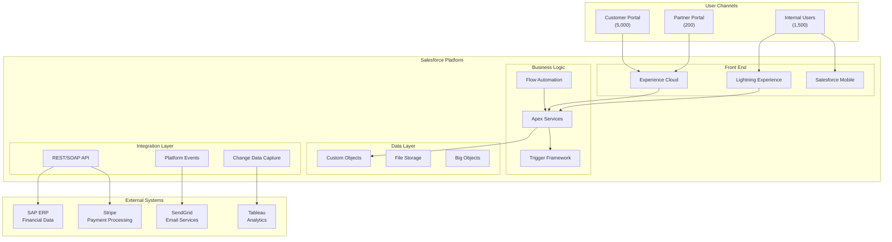
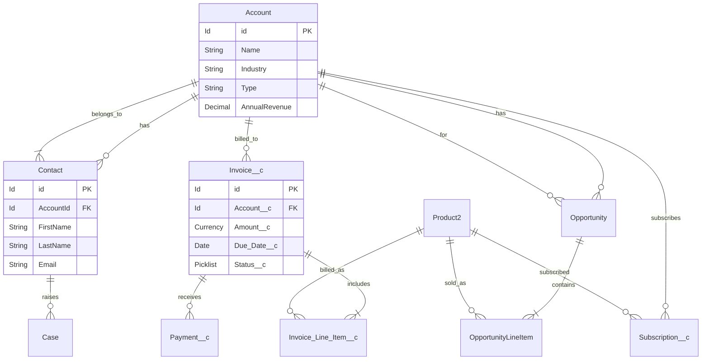

# /siftcoder:sf-architect - Architecture Tools

Generate architecture diagrams, analyze system architecture, and plan capacity for Salesforce implementations.

## Usage

```
/siftcoder:sf-architect analyze        - Analyze org architecture
/siftcoder:sf-architect diagram        - Generate architecture diagrams
/siftcoder:sf-architect limits         - Capacity planning
/siftcoder:sf-architect integration    - Integration architecture
/siftcoder:sf-architect data-model     - Data model visualization
/siftcoder:sf-architect decision       - Architecture decision record
/siftcoder:sf-architect                - Architecture overview
```

## Instructions

### Default: Architecture Overview

```
SALESFORCE ARCHITECTURE OVERVIEW
═══════════════════════════════════════════════════════════════

PROJECT: Sales Cloud Implementation
ORG TYPE: Enterprise Edition

ARCHITECTURE SUMMARY:
┌─────────────────────────────────────────────────────────────┐
│                                                             │
│  ┌─────────────┐  ┌─────────────┐  ┌─────────────┐        │
│  │   Users     │  │  External   │  │   Mobile    │        │
│  │  (1,500)    │  │   Systems   │  │    App      │        │
│  └──────┬──────┘  └──────┬──────┘  └──────┬──────┘        │
│         │                │                │                │
│         └────────────────┼────────────────┘                │
│                          │                                  │
│                          ▼                                  │
│  ┌─────────────────────────────────────────────────────┐  │
│  │              SALESFORCE PLATFORM                      │  │
│  │  ┌─────────┐  ┌─────────┐  ┌─────────┐              │  │
│  │  │  Sales  │  │ Service │  │ Custom  │              │  │
│  │  │  Cloud  │  │  Cloud  │  │  Apps   │              │  │
│  │  └─────────┘  └─────────┘  └─────────┘              │  │
│  │                                                       │  │
│  │  ┌─────────────────────────────────────────────┐    │  │
│  │  │  Platform Services                           │    │  │
│  │  │  Apex | LWC | Flow | API                    │    │  │
│  │  └─────────────────────────────────────────────┘    │  │
│  └─────────────────────────────────────────────────────┘  │
│                                                             │
└─────────────────────────────────────────────────────────────┘

COMPONENTS:
├── Custom Objects: 25
├── Apex Classes: 150
├── Apex Triggers: 20
├── LWC Components: 45
├── Flows: 30
├── Integrations: 8
└── Users: 1,500

[View Full Diagram] [Analyze Architecture] [Export Documentation]
```

### diagram: Generate Architecture Diagrams

```
ARCHITECTURE DIAGRAM GENERATION
═══════════════════════════════════════════════════════════════

Select Diagram Type:
┌─────────────────────────────────────────────────────────────┐
│ [1] System Context Diagram                                 │
│ [2] Integration Architecture                               │
│ [3] Data Flow Diagram                                      │
│ [4] Component Diagram                                      │
│ [5] Security Architecture                                  │
│ [6] All Diagrams                                           │
└─────────────────────────────────────────────────────────────┘

GENERATED: System Context Diagram (Mermaid)
───────────────────────────────────────────────────────────────



GENERATED: Data Model Diagram
───────────────────────────────────────────────────────────────



[Export as PNG] [Export as SVG] [Edit Diagram]
```

### integration: Integration Architecture

```
INTEGRATION ARCHITECTURE
═══════════════════════════════════════════════════════════════

CURRENT INTEGRATIONS:
┌─────────────────────────────────────────────────────────────┐
│ System        │ Direction │ Pattern      │ Volume    │ SLA │
├─────────────────────────────────────────────────────────────┤
│ SAP ERP       │ Bi-dir    │ REST API     │ 10K/day   │ 99% │
│ Stripe        │ Outbound  │ REST API     │ 5K/day    │ 99% │
│ SendGrid      │ Outbound  │ REST API     │ 50K/day   │ 95% │
│ Tableau       │ Outbound  │ CDC          │ Real-time │ 99% │
│ DocuSign      │ Bi-dir    │ REST/Webhook │ 1K/day    │ 99% │
│ Slack         │ Outbound  │ Webhook      │ 2K/day    │ 95% │
│ Legacy CRM    │ Inbound   │ Batch        │ Daily     │ 90% │
│ Data Lake     │ Outbound  │ Batch        │ Nightly   │ 95% │
└─────────────────────────────────────────────────────────────┘

INTEGRATION PATTERNS:
───────────────────────────────────────────────────────────────

1. SYNCHRONOUS (Real-time)
┌─────────────────────────────────────────────────────────────┐
│                                                             │
│  Salesforce ───► Named Credential ───► External API        │
│       ▲                                      │              │
│       └──────────────────────────────────────┘              │
│                   Response                                  │
│                                                             │
│  Use for: Payment processing, validation, real-time sync   │
│                                                             │
└─────────────────────────────────────────────────────────────┘

2. ASYNCHRONOUS (Fire & Forget)
┌─────────────────────────────────────────────────────────────┐
│                                                             │
│  Salesforce ───► Platform Event ───► Subscriber            │
│                                           │                 │
│                                           ▼                 │
│                                    External System          │
│                                                             │
│  Use for: Notifications, logging, non-critical updates     │
│                                                             │
└─────────────────────────────────────────────────────────────┘

3. BATCH (Scheduled)
┌─────────────────────────────────────────────────────────────┐
│                                                             │
│  Scheduled Job ───► Batch Apex ───► External API           │
│                         │                                   │
│                         ▼                                   │
│                   Process Records                           │
│                   (200 at a time)                          │
│                                                             │
│  Use for: Data sync, reporting, large volume operations    │
│                                                             │
└─────────────────────────────────────────────────────────────┘

4. CHANGE DATA CAPTURE (CDC)
┌─────────────────────────────────────────────────────────────┐
│                                                             │
│  Record Change ───► CDC Event ───► External Subscriber     │
│                                                             │
│  Use for: Real-time sync, data replication, analytics      │
│                                                             │
└─────────────────────────────────────────────────────────────┘

RECOMMENDATIONS:
├── [HIGH] Add retry logic to Stripe integration
├── [MEDIUM] Consider CDC for SAP sync instead of polling
├── [LOW] Consolidate email services (SendGrid + internal)

[Generate Integration Map] [View API Usage] [Health Check]
```

### limits: Capacity Planning

```
SALESFORCE CAPACITY PLANNING
═══════════════════════════════════════════════════════════════

ORG LIMITS:

STORAGE:
┌─────────────────────────────────────────────────────────────┐
│ Type                  │ Used      │ Limit     │ %          │
├─────────────────────────────────────────────────────────────┤
│ Data Storage          │ 8.5 GB    │ 20 GB     │ 42.5%      │
│ File Storage          │ 15 GB     │ 50 GB     │ 30%        │
│ Big Objects           │ 500 MB    │ 1 TB      │ <1%        │
└─────────────────────────────────────────────────────────────┘

API LIMITS (24-hour rolling):
┌─────────────────────────────────────────────────────────────┐
│ API Type              │ Used      │ Limit     │ %          │
├─────────────────────────────────────────────────────────────┤
│ REST/SOAP API         │ 450,000   │ 1,000,000 │ 45%        │
│ Bulk API              │ 2,500     │ 15,000    │ 16.7%      │
│ Streaming API         │ 50,000    │ 200,000   │ 25%        │
└─────────────────────────────────────────────────────────────┘

RECORD COUNTS:
┌─────────────────────────────────────────────────────────────┐
│ Object                │ Records   │ Growth/Mo │ Projection │
├─────────────────────────────────────────────────────────────┤
│ Account               │ 50,000    │ +2,000    │ 74K (1yr)  │
│ Contact               │ 200,000   │ +8,000    │ 296K (1yr) │
│ Opportunity           │ 100,000   │ +5,000    │ 160K (1yr) │
│ Invoice__c            │ 75,000    │ +3,000    │ 111K (1yr) │
│ Task                  │ 500,000   │ +20,000   │ 740K (1yr) │
│ Audit_Log__c          │ 2,000,000 │ +100,000  │ 3.2M (1yr) │
└─────────────────────────────────────────────────────────────┘

CAPACITY RECOMMENDATIONS:
───────────────────────────────────────────────────────────────

⚠️ WARNINGS:
├── Audit_Log__c growing rapidly - consider Big Objects
│   Current: 2M records, Projected: 3.2M in 1 year
│   Recommendation: Archive records older than 90 days
│
└── API usage trending up - monitor for spikes
    Current: 45% of daily limit
    Peak times: 9-10 AM, 2-3 PM

✓ HEALTHY:
├── Data storage: 42.5% - adequate headroom
├── File storage: 30% - good capacity
└── Bulk API: 16.7% - well within limits

GROWTH PROJECTION (12 months):
───────────────────────────────────────────────────────────────
Data Storage:  [████████████░░░░░░░░] 60% (12 GB)
API Calls:     [██████████████░░░░░░] 70% (700K/day projected)
Records:       [████████████████░░░░] 80% growth in main objects

RECOMMENDATIONS:
1. Implement data archival strategy for Audit_Log__c
2. Consider upgrading API limit package if growth continues
3. Review Streaming API usage for optimization

[Export Report] [Set Alerts] [View Trends]
```

### decision: Architecture Decision Record

```
ARCHITECTURE DECISION RECORD (ADR)
═══════════════════════════════════════════════════════════════

Creating ADR...

ADR-001: Use Platform Events for Integration Logging
───────────────────────────────────────────────────────────────

## Status
Proposed → Accepted

## Context
We need a reliable logging mechanism for integration callouts
that survives transaction rollbacks and provides real-time
monitoring capabilities.

## Decision
Use Platform Events (Log_Event__e) for integration logging
instead of direct object insertion.

## Rationale
- Platform Events survive transaction rollbacks
- Enable real-time monitoring via subscription
- Decouple logging from transaction processing
- Support external log aggregation (Splunk, DataDog)

## Alternatives Considered

| Option | Pros | Cons |
|--------|------|------|
| Direct Insert | Simple | Lost on rollback |
| Future Method | Async | Limited context |
| Queueable | More control | Complex |
| Platform Events | Reliable, real-time | Learning curve |

## Consequences
- Need to handle Platform Event governor limits
- Must implement subscriber to persist logs
- Additional complexity in architecture
- Enables future monitoring capabilities

## Related ADRs
- ADR-002: Logging Framework Design
- ADR-003: External Monitoring Integration
───────────────────────────────────────────────────────────────

SAVED: docs/architecture/decisions/ADR-001-platform-events-logging.md

[Create Another ADR] [View All ADRs] [Export]
```

## Architecture Patterns

```
SALESFORCE ARCHITECTURE PATTERNS
═══════════════════════════════════════════════════════════════

TRIGGER FRAMEWORK
├── One trigger per object
├── Handler class for logic
├── Bypass mechanism
└── Recursion control

SELECTOR PATTERN
├── Centralized SOQL
├── Field list management
├── Query factory
└── Testability via mocks

SERVICE LAYER
├── Business logic container
├── Transaction boundary
├── Stateless methods
└── Exception handling

UNIT OF WORK
├── DML management
├── Relationship handling
├── Single commit
└── Rollback support

DOMAIN MODEL
├── Object behavior
├── Validation logic
├── Field defaults
└── Trigger delegation
```

## Integration

Works well with:
- `/siftcoder:sf-architect-review` - Architecture review
- `/siftcoder:schema` - Data model design
- `/siftcoder:apex-patterns` - Implementation patterns
