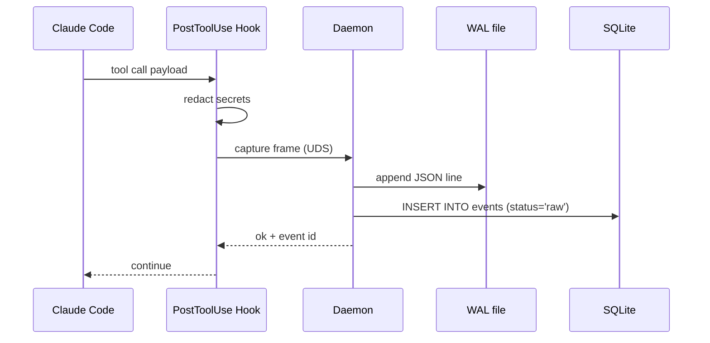
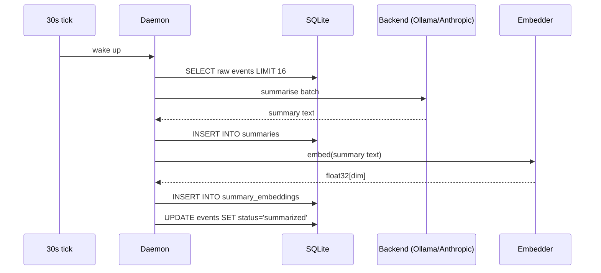
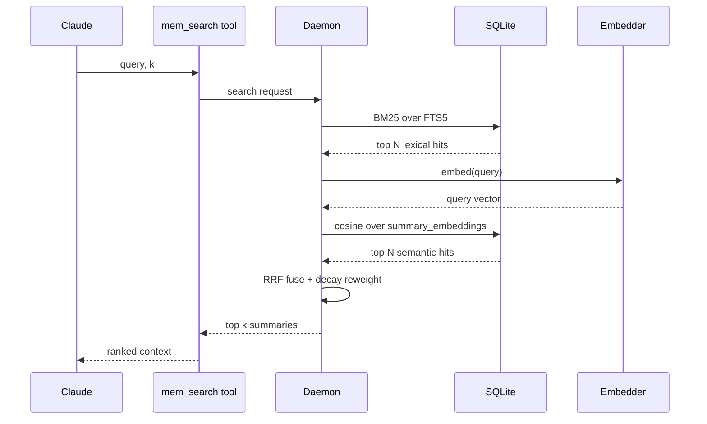

# Architecture overview

This chapter is the map. It names every directory, every process, every socket, every database, and every wire format. Once you've read it, you can debug SiftCoder by inspecting the system instead of guessing.

## On disk

```
~/.siftcoder/<namespace>/
├── config.json                   # global config (per-namespace)
├── run/
│   └── <workspace>.sock          # Unix domain socket per workspace
├── workspaces/
│   └── <workspace>/
│       ├── db.sqlite             # the memory store
│       ├── wal.ndjson            # write-ahead log (line-delimited JSON)
│       ├── run.pid               # daemon pid file
│       └── http.port             # web UI port (when bridge is up)
└── logs/
    └── <workspace>.ndjson        # daemon log stream
```

`<namespace>` defaults to `default`. You can change it with the `SIFTCODER_NS` env var when you want hard isolation between, say, work and personal.

`<workspace>` is a 12-hex-character SHA-256 prefix of the absolute, real-path of the git toplevel of your current directory (or the directory itself, if it isn't a git repo). Two terminals in the same repo share the same workspace key. A symlink trick can't accidentally create a second workspace — `realpath` resolves it.

The plugin itself ships in two places. The repo (or marketplace registry) lives at `~/.claude/plugins/marketplaces/siftcoder-marketplace/` (this is where Claude Code reads versions from). The installed copy used at runtime is at `~/.claude/plugins/cache/siftcoder-marketplace/siftcoder/<version>/`. The latter is what hooks invoke.

## Processes

When you `start` a daemon, you get exactly one Node process per workspace. Visible in `ps`:

```
node /Users/you/.claude/plugins/cache/siftcoder-marketplace/siftcoder/1.0.8/dist/memory/daemon/index.js
```

The daemon owns the SQLite handle, the WAL file, and the Unix socket. It also runs the consolidator on a thirty-second interval and the embedding pass shortly after that. A separate, optional HTTP bridge runs inside the same process and exposes the web UI on a localhost port (random, written to `http.port`).

When Claude Code is running, it spawns short-lived hook processes for each tool call. They connect to the daemon's socket, push a frame, and exit. They are invisible in `ps` because they finish in milliseconds.

When you call any `/siftcoder:mem` slash command, the bundled CLI at `bin/siftcoder.mjs` runs as a one-shot Node process. It either talks to the daemon over the socket (`status`, `info`, `backfill`, `web`) or operates directly on the SQLite file (`drain`, which needs to load LLM clients).

## Wire protocol

Every connection over the Unix socket uses the same length-prefixed JSON frame:

```
+------+--------------------+
| len  | UTF-8 JSON body    |
+------+--------------------+
| 4 B  | <len> bytes        |
+------+--------------------+
```

The `len` is a 4-byte big-endian unsigned integer. Maximum frame is 16 MiB. Each connection is request-response: client opens, sends one frame, reads one frame, closes.

The request kinds are documented in [Wire protocol](../reference/protocol.md). The relevant ones:

| Kind | Purpose |
|---|---|
| `ping` | Liveness check |
| `status` | Daemon status + counts |
| `capture` | Push a tool call event |
| `search` | Hybrid retrieval over summaries |
| `timeline` | Window of summaries around an id |
| `get` | Fetch summaries by id |
| `backfill` | Replay transcripts |
| `shutdown` | Graceful stop |

The capture-side hooks call `capture`. The retrieval-side MCP server calls `search`, `timeline`, and `get`. The CLI calls `ping`, `status`, `backfill`, `shutdown`.

## Storage layout

Three primary tables in the SQLite database.

**`events`** — the raw capture log. Every tool call becomes a row.

| Column | Meaning |
|---|---|
| `id` | Auto-increment primary key |
| `ts` | Unix milliseconds when captured |
| `session_id` | Claude Code session that produced it |
| `tool` | Tool name (`Read`, `Write`, `Edit`, `Bash`, `Grep`, `Glob`) |
| `input_hash` | SHA-256 of the redacted payload (used for dedupe) |
| `payload_json` | Full payload after redaction |
| `tokens_est` | Rough token count for budgeting |
| `status` | `raw`, `summarized`, or `skipped` |

**`summaries`** — LLM-condensed versions of events. Many-events-to-many-summaries; the consolidator decides how to group.

| Column | Meaning |
|---|---|
| `id` | Auto-increment primary key |
| `event_id` | Source event |
| `text` | Plain-text summary |
| `created_at` | Unix milliseconds |
| `model` | Backend that produced it (`ollama:llama3.2:3b`, `anthropic:haiku`, etc.) |
| `tokens_used` | Inference tokens spent |

**`summary_embeddings`** — vector representations.

| Column | Meaning |
|---|---|
| `summary_id` | Foreign key into `summaries` |
| `vec` | BLOB containing a packed float32 array |
| `dim` | Vector dimension (typically 384 or 768) |

Plus a few auxiliary tables: `sessions` (session metadata), `pattern_index` (the symbol extractor's output for code-shaped events), and the FTS5 virtual tables that back the BM25 leg of search.

The schema is created at first daemon start. Migrations are forward-only and run automatically; there is no manual migration step.

## The capture path



The hook adds about 2 ms of latency to a tool call. The WAL flush is `fsync`'d so a crash mid-capture doesn't lose the event. The SQLite insert is single-row, indexed, and routinely under a millisecond.

## The consolidation path



The consolidator processes events in batches. Default batch size is 16, default tick is 30 seconds — both tunable in `config.json`. If the LLM rejects a batch (rate limit, network error, etc.) the events stay `raw` and are retried on the next tick. After a configurable number of failures they are marked `skipped` and never retried.

## The retrieval path



Retrieval blends BM25 and vector similarity through reciprocal rank fusion (RRF), which is more robust than weighted sums and doesn't require either method to know the other's score scale. The fused list is then multiplied by an exponential time decay so older memories naturally fade. Retrieval is read-only; it never mutates the store.

## Hooks layer

SiftCoder ships seven hooks. Three are essential, four are quality-of-life.

**Essential**:

- `SessionStart` (`hooks/session-start/ensure-built.mjs`) — verifies `dist/` exists, runs the `v3 → default` namespace migration if needed, starts the daemon if it isn't running.
- `PreToolUse` (`hooks/pre-tool-use/boundary-enforcer.mjs`) — blocks `Write`/`Edit` outside the configured scope.
- `PostToolUse` (`hooks/post-tool-use/capture-observation.mjs`) — captures the tool call.

**Quality of life**:

- `UserPromptSubmit` — injects relevant memories into Claude's context based on the user's prompt.
- `Stop` — flushes WAL and runs a fast drain pass before the session ends.
- `SubagentStop` — same as `Stop` but for subagent terminations.
- `SessionEnd` — final cleanup, writes a session-summary log.

Each hook reads its config from the plugin's `settings.json` and respects per-workspace overrides at `.siftcoder/config.json`.

## MCP integration

SiftCoder's MCP server is registered in `.claude-plugin/plugin.json` as `siftcoder-memory`. It exposes seven tools to Claude:

| Tool | Purpose |
|---|---|
| `mem_search` | Hybrid retrieval over summaries |
| `mem_get` | Fetch by id |
| `mem_timeline` | Window of summaries around an id |
| `mem_drain` | Force a consolidation pass |
| `mem_why` | Explain why a hit ranked where it did (debug) |

Claude calls these the same way it calls any other MCP tool. There is no special wiring — they look like Read/Write/Bash from the LLM's perspective. The tools and the MCP transport are documented in [MCP server](../reference/mcp.md).

## Where to look when something breaks

| Symptom | First place to look |
|---|---|
| "Daemon unreachable" | `~/.siftcoder/default/logs/<workspace>.ndjson` — the last thirty lines |
| Capture not happening | Run `/siftcoder:mem info` and check the `events` counter; if it's not moving, hooks aren't firing |
| Summarisation stuck at zero | `backends` line in `info`; force a drain with `/siftcoder:mem drain 8` and read the error |
| Search returns nothing | Check that `summaries` and `embeddings` counts match; if embeddings is far behind, the embedder is failing — see backend config |
| Web UI won't open | `~/.siftcoder/default/workspaces/<key>/http.port` should exist; if it doesn't, the bridge crashed at startup |
| Boundary enforcer not blocking | `.siftcoder/scope.json` syntax; it's strict JSON, and a comma-comment will silently skip the file |

The [Troubleshooting](../operations/troubleshooting.md) page goes through each of these in detail.

That's the system. Hooks feed the daemon, the daemon writes to the store, retrieval reads back. Everything else in this guide is a consequence of those four pieces.
