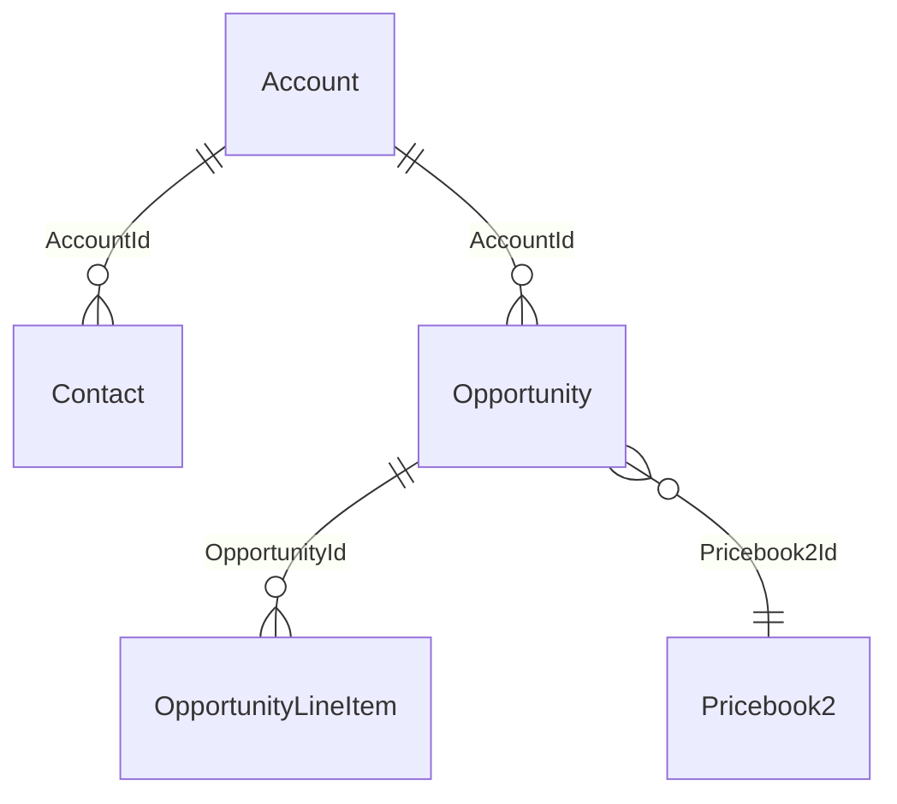

# Schema

Schema work is where Salesforce projects most often quietly go wrong. A field gets renamed in a sandbox, a picklist value shrinks in a hotfix, a lookup gets pointed at a new parent — and three months later a report breaks, or a flow stops firing, or a managed-package install fails with a cryptic dependency error.

The two skills covered here exist to make those changes traceable. The `schema` skill handles day-to-day work — adding objects and fields, drawing relationships, picking between Custom Metadata, Custom Settings, and plain records. The `schema-migrate` skill handles the harder case where existing data has to survive a metadata change.

## What `schema` does

Invoked via `/siftcoder:schema` or auto-loaded when you ask Claude something like "add a Region field to Account" or "draw an ERD of the order system."

The skill reads `force-app/main/default/objects/` from your sfdx project, builds an in-memory model of the schema (objects, fields, relationships, validation rules, record types), and then operates on that model to answer questions or generate metadata.

Common moves:

- `/siftcoder:schema erd` — generate a Mermaid ER diagram of the objects in the project. Defaults to all custom objects plus standard objects that have custom fields. Filterable by namespace or list of objects.
- `/siftcoder:schema field add Account Region__c picklist` — write the `.field-meta.xml`, register it on profiles/permsets if those exist, and remind you to run `sf project deploy validate`.
- `/siftcoder:schema relationship Account Region__c lookup Region__c` — adds a lookup field, sets up the back-reference, warns if the relationship is in a hierarchy where deletion behaviour matters.
- `/siftcoder:schema review Account` — read the metadata for one object and surface what's odd: too many fields, picklists with single values, validation rules that look dead, formula fields that reference deleted fields.

The skill knows the difference between Custom Metadata, Custom Settings, and Custom Object records — and will push back when the wrong one's been chosen.

## Custom Metadata vs Custom Settings vs records — the actual decision tree

Engineers new to the platform routinely choose wrong here. The skill encodes the rule of thumb:

- **Custom Metadata Types** when you have *configuration* that varies by environment and ships with the org. Tax tables. Approval thresholds. Webhook signing keys (with the protected flag). Anything you'd commit to source control if Salesforce let you.
- **Custom Settings (Hierarchy)** when you have *user/profile-overridable runtime knobs*. Feature flags per profile. Integration timeouts you might tune in production without a deploy. The list-type custom settings are mostly legacy at this point — Custom Metadata covers the same use cases and is queryable.
- **Custom Object records** when the data is *business data* — created and modified by users, reportable, sharable, owned. If a record represents an Order or a Contact or a Cat (in a vet org), it's a Custom Object record. Not Custom Metadata. Not Custom Settings.

The skill tags any `Custom Setting` it sees in your project and asks whether it should be migrated to Custom Metadata. Most should. Custom Settings have lousy tooling — no source-control friendly export, no field tracking, no real test stories. Custom Metadata fixes all of that. The migration is mechanical (the skill will write the conversion script).

## ERD generation

Worth dwelling on briefly because most teams don't have one and nobody enjoys drawing them by hand.

`/siftcoder:schema erd` reads every `.object-meta.xml` and `.field-meta.xml`, finds the lookup and master-detail fields, and renders a Mermaid diagram:



You can paste it into a README, a docs site, or wherever your team puts diagrams. The skill also supports `--format dot` for Graphviz and `--format json` for further processing.

The diagram is generated from metadata, not from the live org. That's a feature: it shows what's in the source, which is what will be deployed, which may differ from what's in production. Run it on the source branch you're about to deploy and you have an authoritative picture of the target state.

## What `schema-migrate` does

This is the harder skill. It handles the case where you're not just adding a field — you're changing one, removing one, narrowing a type, converting a text field to a picklist, or rerouting a lookup to a new parent. Anything where existing data might not survive the change.

The skill's contract:

1. **Source state.** What does the current schema look like? Read from metadata or query the org directly with `sf data query`.
2. **Target state.** What do you want it to look like? Read from the proposed branch or a written spec.
3. **Diff.** Per object: fields added, removed, type-changed; relationships altered; picklist values added or deleted; validation rules affected.
4. **Risk classification.** Per change:
   - **Safe** — additive, no existing data affected.
   - **Lossy** — existing data must be transformed before the schema change (e.g. text → picklist, where existing values may not map cleanly).
   - **Breaking** — existing data won't fit the new schema and will be rejected on deploy (e.g. shrinking a `Text(255)` to `Text(80)` when some records have 100-char values).
5. **Deploy plan.** Pre-deploy data transforms, schema deploy, post-deploy verification queries.
6. **Rollback.** Per change. The skill is honest: many metadata changes don't roll back cleanly, and it flags those instead of pretending otherwise.

The output is a written migration plan you can review, share with the team, and execute one step at a time.

## A worked example: adding a lookup across a hierarchy

You have a `Region__c` object. You want to add a `Region__c` lookup to `Account`. Existing accounts have a free-text `Region_Name__c` field that you've been using as a placeholder for years. Now you want to link them properly.

Step one — generate the diff.

```bash
/siftcoder:schema-migrate diff
```

The skill reads the proposed metadata (the new lookup field on Account) and compares it against the current org. Output:

```
| Object   | Field                | Change            | Risk   |
|----------|----------------------|-------------------|--------|
| Account  | Region__c            | added (lookup)    | Safe   |
| Account  | Region_Name__c       | (still present)   | —      |
```

Schema-wise this is a safe additive change. The risk isn't in the metadata — it's in the data migration to populate the new lookup from the old text field.

Step two — pre-deploy data work. The skill scaffolds a transform:

```bash
sf data query --query "SELECT Id, Region_Name__c FROM Account WHERE Region_Name__c != null" --result-format csv > accounts-regions.csv
```

It also looks at the distinct values:

```
SELECT Region_Name__c, COUNT(Id) FROM Account
WHERE Region_Name__c != null
GROUP BY Region_Name__c
```

Eighteen distinct text values. There are six Region records. The skill maps them by similarity (`North America` → `Region.NorthAmerica__r.Name`) and produces a CSV of *unmapped* values for you to resolve by hand. This is the part you can't automate. The skill is honest about that.

Step three — deploy the schema. Validate first.

```bash
sf project deploy validate --source-dir force-app --test-level RunLocalTests --target-org uat
```

If validate passes, deploy:

```bash
sf project deploy start --source-dir force-app --test-level RunLocalTests --target-org uat
```

Step four — backfill the lookup. The skill scaffolds an Apex script (anonymous or batch) that reads each Account, finds the matching Region by your mapping CSV, and sets `Account.Region__c`. For 1,000 accounts use anonymous; for 100,000 use a batch job.

Step five — verify. Reconciliation queries:

```sql
-- All accounts now have the lookup populated where the text field was
SELECT COUNT(Id) FROM Account WHERE Region_Name__c != null AND Region__c = null
-- Expected: 0
```

If that returns non-zero, you have unmapped values. The skill surfaces them.

Step six — *optional* — deprecate the old text field. The skill recommends keeping it for one release as a safety net (you can always backfill again from it if something went wrong) and removing it in the next migration. Removing a field with data in it is itself a `schema-migrate` job, with the same diff/risk/plan cycle.

That whole flow is one feature — adding a lookup — but the data side is most of the work. The skill makes the data side explicit instead of letting it lurk in someone's head until production breaks.

## Rules the skills enforce

A few non-negotiables worth flagging:

- **Every change cites a metadata file.** No claim about "Account.Industry" without a path to the `.field-meta.xml` it lives in.
- **Lossy changes block until pre-deploy is written.** The skill won't let you generate a deploy plan that includes a text→picklist conversion without a corresponding data transform step.
- **Picklist value deletion checks dependents.** Validation rules, formula fields, flows that reference the value are flagged before you remove it.
- **Type narrowing requires a backup.** `Text(255)` → `Text(80)` requires a `sf project retrieve start --metadata Account` snapshot in the plan.
- **No "we'll deal with rollback if needed."** Either there's a real rollback path or the change is flagged as non-reversible. Calling something non-reversible out loud is more useful than pretending you have a rollback you haven't tested.

## When to skip the skill

- **Greenfield orgs with no data.** Just deploy. There's nothing to migrate.
- **Pure data moves (no schema change).** Use the generic `/siftcoder:migrate` skill instead — it's shaped for ETL, not metadata.
- **Trivial additive changes.** `/siftcoder:schema field add` is enough; don't drag the migration skill in for a one-field add.

## Cross-references

- [Deploy chapter](deploy.md) covers what happens after the schema change is ready to ship.
- [Architecture chapter](architecture.md) covers the `org-comparison-tool` and `repo-vs-deployed-analyzer` skills, which find schema drift across orgs.
- The legacy [Salesforce reference](../reference/skills.md#schema-migrate) has the full skill body.

Next: [the deploy workflow](deploy.md).
