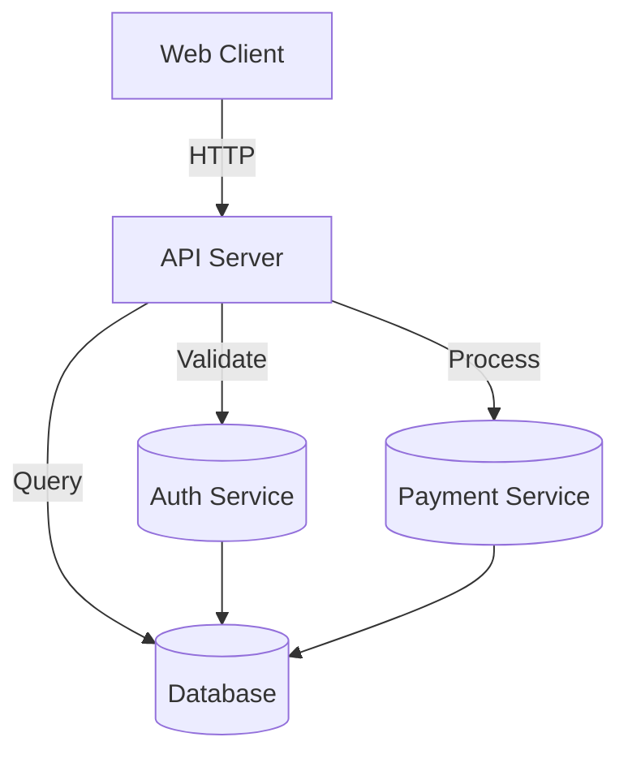

# DOCUMENT Workflow Commands

**Documentation generation**

The DOCUMENT workflow contains commands for generating comprehensive documentation - from inline code comments to architecture diagrams to end-user guides.

---

## Commands Overview

| Command | Purpose | Difficulty | Time | Output |
|---------|---------|------------|------|--------|
| [`/document code`](#document-code) | Inline code documentation | ⭐ Beginner | 2-10 min | Docstrings, comments, type annotations |
| [`/document user-manual`](#document-user-manual) | End-user documentation | ⭐⭐ Intermediate | 5-15 min | User guides, FAQs |
| [`/document architecture`](#document-architecture) | System architecture diagrams | ⭐⭐ Intermediate | 5-15 min | Mermaid diagrams |
| [`/document technical`](#document-technical) | Technical/ops documentation | ⭐⭐ Intermediate | 10-20 min | API docs, deployment guides |

---

## /document code

Generate inline code documentation - docstrings, comments, and type annotations.

### Quick Overview
- **Purpose**: Generate inline code documentation
- **Difficulty**: ⭐ Beginner
- **Time Estimate**: 2-10 min
- **Mode**: Write-enabled

### When to Use This Command

✅ **Use this when:**
- Code lacks documentation
- You need docstrings for functions/classes
- You want inline comments for complex logic
- Type annotations are missing

❌ **Don't use when:**
- Code is already well documented
- You need system-level docs (use `/document architecture`)

### Syntax

```bash
/siftcoder:document code [path]
```

**Arguments:**
- `path` (optional): Specific file or directory to document (default: entire codebase)

### How It Works

1. **Code Analysis**
   - Parses code structure
   - Identifies functions, classes, methods
   - Detects existing documentation

2. **Documentation Generation**
   - Adds JSDoc/PyDoc/docstrings
   - Inserts inline comments for complex logic
   - Adds type annotations where missing

3. **README Generation**
   - Creates directory README.md files
   - Documents file purposes

### Examples

#### Document a Single File

```bash
/siftcoder:document code src/services/payment.ts
```

**Before:**
```typescript
export function processPayment(amount, currency, userId) {
  if (amount <= 0) throw new Error('Invalid amount');
  // ... processing logic
}
```

**After:**
```typescript
/**
 * Process a payment for a user.
 *
 * @param amount - Payment amount in cents (must be positive)
 * @param currency - ISO 4217 currency code (e.g., 'USD', 'EUR')
 * @param userId - User ID to charge
 * @returns Payment result with charge ID and status
 * @throws {Error} If amount is invalid or user not found
 *
 * @example
 * ```ts
 * const result = await processPayment(1000, 'USD', 'user-123');
 * console.log(result.chargeId); // 'ch_1234567890'
 * ```
 */
export async function processPayment(
  amount: number,
  currency: string,
  userId: string
): Promise<PaymentResult> {
  // Validate amount - must be positive integer
  if (amount <= 0) {
    throw new Error('Invalid amount: must be positive');
  }

  // ... processing logic
}
```

#### Document Entire Codebase

```bash
/siftcoder:document code
```

**Output:**
```
📚 Documenting codebase...

Files analyzed: 89
Functions documented: 234
Classes documented: 45
Type annotations added: 67

Created:
  ├── src/README.md (module overview)
  ├── src/services/README.md
  └── src/components/README.md
```

---

## /document user-manual

Create end-user documentation explaining how to use the application.

### Quick Overview
- **Purpose**: Generate end-user documentation
- **Difficulty**: ⭐⭐ Intermediate
- **Time Estimate**: 5-15 min
- **Mode**: Write-enabled

### When to Use This Command

✅ **Use this when:**
- You need user-facing documentation
- Creating getting started guides
- Documenting features for end users

### Syntax

```bash
/siftcoder:document user-manual
```

### Output

Creates `docs/user-guide/` with:
- `getting-started.md` - Installation and first steps
- `features.md` - Feature descriptions
- `faq.md` - Common questions
- `troubleshooting.md` - Common issues and solutions

---

## /document architecture

Generate system architecture diagrams in Mermaid format.

### Quick Overview
- **Purpose**: Generate architecture diagrams
- **Difficulty**: ⭐⭐ Intermediate
- **Time Estimate**: 5-15 min
- **Mode**: Write-enabled

### When to Use This Command

✅ **Use this when:**
- You need system architecture documentation
- Onboarding new developers
- Planning system changes
- Creating technical design docs

### Syntax

```bash
/siftcoder:document architecture
```

### How It Works

1. **System Analysis**
   - Identifies components and modules
   - Maps data flows
   - Detects dependencies

2. **Diagram Generation**
   - System overview diagram
   - Component diagrams
   - Data flow diagrams
   - Dependency graphs

### Examples

```bash
/siftcoder:document architecture
```

**Output:**
```
📊 Generating architecture diagrams...

Created docs/architecture/:
  ├── system-overview.mmd      - High-level system diagram
  ├── components.mmd           - Component relationships
  ├── data-flow.mmd            - Data flow diagrams
  ├── database-schema.mmd      - Database structure
  └── api-endpoints.mmd        - API structure

✅ Diagrams generated in Mermaid format
   Render with: mermaid-cli or view in Markdown viewers
```

**Example diagram (`system-overview.mmd`):**


---

## /document technical

Create technical/ops documentation including API reference, deployment guides, and operations manuals.

### Quick Overview
- **Purpose**: Generate technical documentation
- **Difficulty**: ⭐⭐ Intermediate
- **Time Estimate**: 10-20 min
- **Mode**: Write-enabled

### When to Use This Command

✅ **Use this when:**
- Creating API documentation
- Writing deployment guides
- Documenting configuration
- Creating operations runbooks

### Syntax

```bash
/siftcoder:document technical
```

### Output

Creates `docs/technical/` with:
- `api-reference.md` - API endpoints and schemas
- `deployment.md` - Deployment instructions
- `configuration.md` - Configuration options
- `operations.md` - Operations runbook
- `security.md` - Security documentation

---

## Workflow Examples

### Complete Documentation Workflow

```bash
# 1. Generate architecture diagrams
/siftcoder:document architecture

# 2. Document code with inline docs
/siftcoder:document code src/services/

# 3. Create user manual
/siftcoder:document user-manual

# 4. Generate technical docs
/siftcoder:document technical

# 5. Review generated documentation
ls docs/
```

### Quick Documentation for New Feature

```bash
# After adding a feature with /add-feature

# Document the new code
/siftcoder:document code src/features/newFeature/

# Update architecture docs
/siftcoder:document architecture
```

---

## See Also

- [BUILD Workflow](build-workflow.md) - Create projects
- [UNDERSTAND Workflow](understand-workflow.md) - Analyze codebase
- [Workflow: Generate Documentation](../../05-workflows/generate-documentation.md)
- [Use Case: Documentation Generation](../../06-use-cases/by-task-type/documentation-generation.md)
