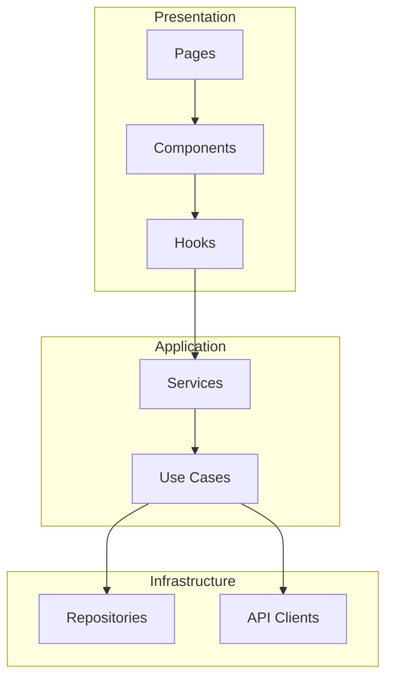
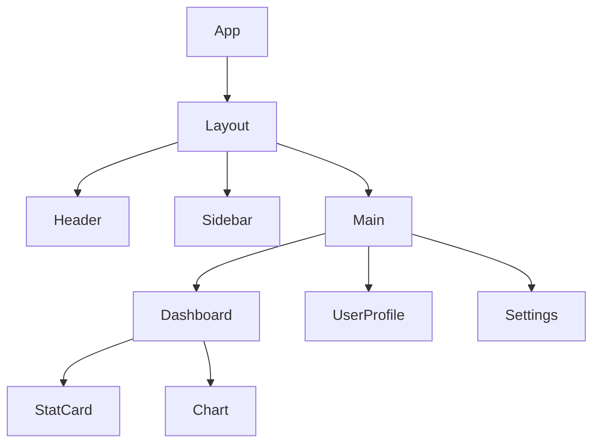
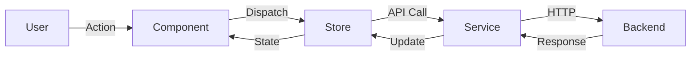
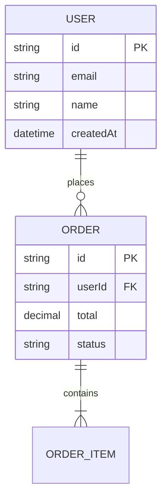
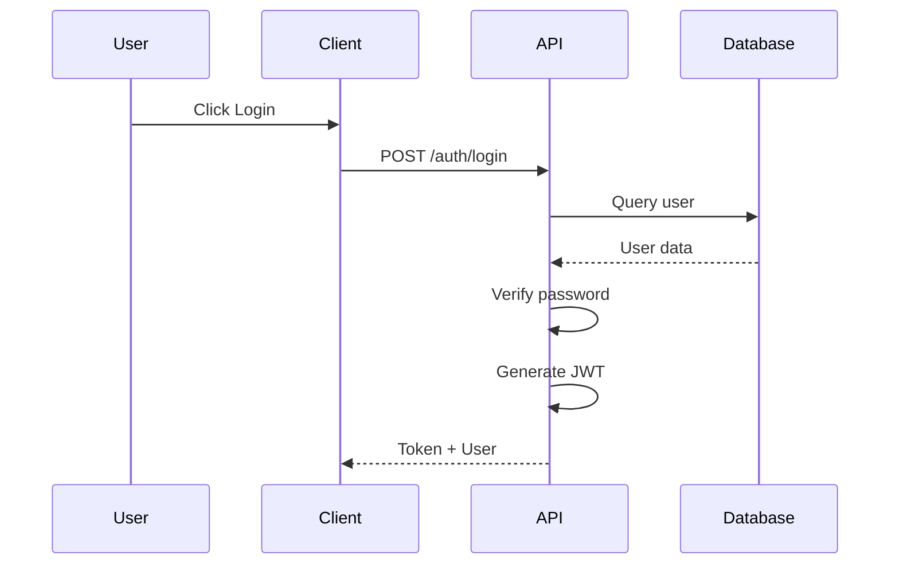

# Skill: Diagram Generator

**Generate visual documentation including Mermaid diagrams**

---

## Overview
- **Purpose**: Create visual representations of code structure and architecture
- **Type**: Documentation
- **Invoked By**: `/document architecture`, `/understand --deep`

---

## What This Skill Does

Generates various diagram types:

1. **Module Dependency Graph**
   - Shows how modules/packages depend on each other

2. **Component Hierarchy**
   - Tree structure of UI components (React, Vue, etc.)

3. **Data Flow Diagram**
   - How data moves through the application

4. **Database Schema (ERD)**
   - Entity relationships

5. **API Endpoint Map**
   - REST/GraphQL endpoints and relationships

6. **Sequence Diagram**
   - Request/response flows for operations

7. **State Machine**
   - State transitions

---

## Diagram Types

### Module Dependency Graph



### Component Hierarchy



### Data Flow



### Database Schema (ERD)



### Sequence Diagram



---

## Output Structure

Diagrams saved to `.claude/siftcoder-state/diagrams/`:

```
diagrams/
├── architecture.mmd           # Module dependency
├── components.mmd             # Component hierarchy
├── data-flow.mmd              # Data flow
├── database-schema.mmd        # ERD
├── api-map.mmd                # API endpoints
└── README.md                  # Index of diagrams
```

---

## Rendering Options

### Option 1: Mermaid CLI

```bash
npm install -g @mermaid-js/mermaid-cli
mmdc -i diagrams/architecture.mmd -o diagrams/architecture.svg
```

### Option 2: VS Code Extension

Install "Mermaid Preview" extension for live preview.

### Option 3: Online

Paste into https://mermaid.live/ for quick rendering.

---

## Integration with ContextDigger

If ContextDigger is available, provides enhanced capabilities:
- Automatic area discovery
- Cohesion/coupling metrics
- Governance visualization
- More accurate dependency detection

---

## Examples

### Generating Architecture Diagrams

```bash
/siftcoder:document architecture
```

**Output:**
```
📊 Generating architecture diagrams...

Created docs/architecture/:
  ├── system-overview.mmd      - High-level system diagram
  ├── components.mmd           - Component relationships
  ├── data-flow.mmd            - Data flow diagrams
  ├── database-schema.mmd      - Database structure
  └── api-endpoints.mmd        - API structure

✅ Diagrams generated in Mermaid format
```

### Deep Understanding with Diagrams

```bash
/siftcoder:understand --deep
```

**Includes diagram generation for:**
- Dependency graphs
- Data flows
- Component hierarchies

---

## Integration

### Commands Using This Skill
- `/document architecture` - Main command for diagram generation
- `/understand --deep` - Includes diagrams in analysis

### Related Skills
- `pattern-detector` - Analyzes structure before diagramming
- `document` - Generates other documentation types

---

## See Also

- [Command: /document architecture](../02-command-reference/by-category/document-workflow.md#document-architecture)
- [Command: /understand](../02-command-reference/by-category/understand-workflow.md#understand)
- [Skill: Pattern Detector](pattern-detector.md)
