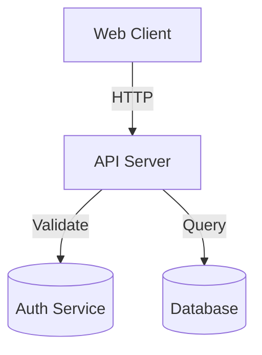

# Workflow: Generate Documentation

**Create comprehensive documentation for your codebase**

---

## Overview

This workflow guides you through generating various types of documentation:

1. **Code Documentation** - Inline comments, docstrings, type annotations
2. **Architecture Diagrams** - Mermaid diagrams for system design
3. **User Manuals** - End-user guides and FAQs
4. **Technical Docs** - API references, deployment guides

**Time Estimate:** 15 min - 1 hour

**Difficulty:** ⭐ Beginner to Intermediate

---

## Prerequisites

- [ ] Existing codebase
- [ ] SiftCoder plugin loaded

---

## Step-by-Step Workflow

### Option A: Generate All Documentation

```bash
# 1. Architecture diagrams
/siftcoder:document architecture

# 2. Inline code documentation
/siftcoder:document code src/

# 3. User manual
/siftcoder:document user-manual

# 4. Technical documentation
/siftcoder:document technical
```

### Option B: Specific Documentation Type

Choose based on what you need.

---

## Documentation Types

### 1. Architecture Diagrams

Generate visual system architecture:

```bash
/siftcoder:document architecture
```

**Output:**
```
📊 Generating architecture diagrams...

Scanning codebase...
  Found 12 modules
  Found 24 components
  Found 6 database tables

Generating diagrams:
  ✓ System overview
  ✓ Component hierarchy
  ✓ Data flow
  ✓ Database schema (ERD)
  ✓ API endpoints

Created: docs/architecture/
├── system-overview.mmd
├── components.mmd
├── data-flow.mmd
├── database-schema.mmd
└── api-map.mmd

💡 To render:
  Option 1: mmdc -i diagram.mmd -o diagram.svg
  Option 2: Paste into https://mermaid.live/
```

**Example diagram:**


---

### 2. Code Documentation

Generate inline code documentation:

```bash
# Document entire codebase
/siftcoder:document code

# Document specific directory
/siftcoder:document code src/services/

# Document specific file
/siftcoder:document code src/services/payment.ts
```

**What it adds:**
- JSDoc/PyDoc docstrings
- Inline comments for complex logic
- Type annotations where missing
- README.md for directories

**Before:**
```typescript
export function processPayment(amount, currency, userId) {
  if (amount <= 0) throw new Error('Invalid amount');
  // ... logic
}
```

**After:**
```typescript
/**
 * Process a payment for a user.
 *
 * @param amount - Payment amount in cents (must be positive)
 * @param currency - ISO 4217 currency code (e.g., 'USD', 'EUR')
 * @param userId - User ID to charge
 * @returns Payment result with charge ID and status
 * @throws {Error} If amount is invalid or user not found
 *
 * @example
 * ```ts
 * const result = await processPayment(1000, 'USD', 'user-123');
 * console.log(result.chargeId); // 'ch_1234567890'
 * ```
 */
export async function processPayment(
  amount: number,
  currency: string,
  userId: string
): Promise<PaymentResult> {
  // Validate amount - must be positive integer
  if (amount <= 0) {
    throw new Error('Invalid amount: must be positive');
  }

  // ... processing logic
}
```

---

### 3. User Manual

Generate end-user documentation:

```bash
/siftcoder:document user-manual
```

**Output:**
```
📚 Generating user manual...

Created: docs/user-guide/
├── getting-started.md
├── features.md
├── faq.md
└── troubleshooting.md
```

**Contents:**
- Getting Started Guide
- Feature Descriptions
- Common Tasks
- FAQ
- Troubleshooting

---

### 4. Technical Documentation

Generate technical/ops documentation:

```bash
/siftcoder:document technical
```

**Output:**
```
📚 Generating technical documentation...

Created: docs/technical/
├── api-reference.md       # API endpoints and schemas
├── deployment.md           # Deployment instructions
├── configuration.md        # Configuration options
├── operations.md          # Operations runbook
└── security.md            # Security documentation
```

---

## Commands Reference

| Command | Output | Use When |
|---------|--------|----------|
| `/document architecture` | Mermaid diagrams | System design docs |
| `/document code [path]` | Inline docs | Code documentation |
| `/document user-manual` | User guide | End-user docs |
| `/document technical` | Technical docs | Developer/Ops docs |

---

## Tips & Best Practices

### Architecture Diagrams

✅ **DO:**
- Generate early in project
- Update after major changes
- Include in project README
- Use for team onboarding

❌ **DON'T:**
- Let diagrams get stale
- Skip diagram generation
- Forget to update after changes

### Code Documentation

✅ **DO:**
- Document public APIs
- Comment complex logic
- Add type annotations
- Document parameters and returns

❌ **DON'T:**
- Document obvious code
- Add redundant comments
- Skip error documentation

### User Manuals

✅ **DO:**
- Write for non-technical users
- Include screenshots/examples
- Cover common tasks
- Add troubleshooting section

❌ **DON'T:**
- Use technical jargon
- Assume prior knowledge
- Skip edge cases

---

## Workflow Examples

### Complete Documentation for New Project

```bash
# 1. Architecture diagrams
/siftcoder:document architecture

# 2. Code documentation
/siftcoder:document code src/

# 3. User manual
/siftcoder:document user-manual

# 4. Technical docs
/siftcoder:document technical

# 5. Review
ls docs/
```

### Quick Documentation Update

```bash
# After adding a feature
/siftcoder:document code src/features/newFeature/
/siftcoder:document architecture
```

### Documentation for Specific Area

```bash
# Document authentication module
/siftcoder:document code src/auth/
```

---

## Rendering Mermaid Diagrams

### Option 1: Mermaid CLI

```bash
npm install -g @mermaid-js/mermaid-cli
mmdc -i docs/architecture/system-overview.mmd -o docs/architecture/system-overview.svg
```

### Option 2: VS Code

Install "Mermaid Preview" extension for live preview.

### Option 3: Online

Paste `.mmd` content into https://mermaid.live/

---

## Documentation Structure

```
docs/
├── architecture/           # Visual diagrams
│   ├── system-overview.mmd
│   ├── components.mmd
│   ├── data-flow.mmd
│   └── database-schema.mmd
│
├── user-guide/             # End-user docs
│   ├── getting-started.md
│   ├── features.md
│   └── faq.md
│
├── technical/              # Technical docs
│   ├── api-reference.md
│   ├── deployment.md
│   └── configuration.md
│
└── README.md               # Main documentation hub
```

---

## See Also

- [Command: /document](../02-command-reference/by-category/document-workflow.md)
- [Skill: Diagram Generator](../03-skills-reference/diagram-generator.md)
- [Use Case: Documentation Generation](../06-use-cases/by-task-type/documentation-generation.md)
