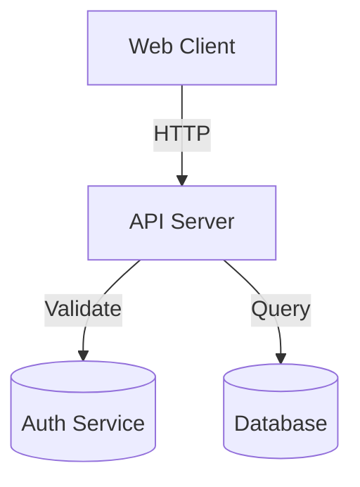

# Use Case: Documentation Generation

**Creating comprehensive documentation**

---

## Overview

Good documentation is essential but time-consuming. SiftCoder automates documentation generation for:

- Architecture diagrams
- Inline code comments
- User manuals
- API references
- Deployment guides

---

## Quick Start

```bash
# Generate all documentation types
/siftcoder:document architecture
/siftcoder:document code src/
siftcoder:document user-manual
siftcoder:document technical
```

---

## Documentation Types

### 1. Architecture Diagrams

Generate Mermaid diagrams for system design:

```bash
/siftcoder:document architecture
```

**Creates:**
- System overview diagram
- Component hierarchy
- Data flow diagrams
- Database schema (ERD)
- API endpoint map

**Example output:**


### 2. Code Documentation

Add inline documentation to code:

```bash
# Document entire codebase
/siftcoder:document code

# Document specific directory
/siftcoder:document code src/services/

# Document specific file
/siftcoder:document code src/services/payment.ts
```

**What it adds:**
- JSDoc/PyDoc docstrings
- Type annotations
- Inline comments for complex logic
- README.md for directories

### 3. User Manual

End-user documentation:

```bash
/siftcoder:document user-manual
```

**Creates:**
- Getting Started guide
- Feature descriptions
- FAQ section
- Troubleshooting guide

### 4. Technical Documentation

Developer and ops documentation:

```bash
/siftcoder:document technical
```

**Creates:**
- API reference
- Deployment guide
- Configuration guide
- Operations runbook
- Security documentation

---

## Workflow Examples

### For New Projects

```bash
# After /build completes
/siftcoder:document architecture
siftcoder:document code src/
siftcoder:document user-manual
```

### For Existing Projects

```bash
# Update architecture docs
siftcoder:document architecture

# Add code docs to new module
siftcoder:document code src/new-module/
```

### For APIs

```bash
# Generate OpenAPI spec
/siftcoder:api document

# Validate
siftcoder:api validate

# Generate docs
/siftcoder:document technical
```

---

## Best Practices

### When to Generate Docs

✅ **DO:**
- After feature completion
- Before releases
- When onboarding new team members
- After major refactoring

❌ **DON'T:**
- Generate once and forget
- Skip documentation for "quick" changes
- Let docs get stale

### Documentation Maintenance

✅ **DO:**
- Update docs after changes
- Keep diagrams in sync
- Review documentation accuracy

❌ **DON'T:**
- Let docs diverge from code
- Skip updating after changes
- Ignore outdated diagrams

---

## Example: Complete Documentation

```bash
# Project: E-commerce API

# 1. Architecture diagrams
/siftcoder:document architecture

# 2. API documentation
/siftcoder:api document
siftcoder:api validate

# 3. Code documentation
/siftcoder:document code src/

# 4. User manual
/siftcoder:document user-manual

# 5. Technical docs
/siftcoder:document technical

# 6. Review
ls docs/
```

**Result:**
```
docs/
├── architecture/
│   ├── system-overview.mmd
│   ├── data-flow.mmd
│   └── database-schema.mmd
├── api/
│   └── openapi.yaml
├── user-guide/
│   ├── getting-started.md
│   └── api-usage.md
└── technical/
    ├── deployment.md
    └── configuration.md
```

---

## See Also

- [Workflow: Generate Documentation](../../05-workflows/generate-documentation.md)
- [Command: /document](../02-command-reference/by-category/document-workflow.md)
- [Skill: Diagram Generator](../../03-skills-reference/diagram-generator.md)
